# Implementation Plan — No-Code Agent Builder with Context Studio

> **Version:** 2.0 (Research-Enhanced)  
> **Date:** 2026-06-21  
> **Status:** 🔶 Awaiting Approval

---

## Table of Contents

1. [Research Paper Analysis & Adoption Decisions](#1-research-paper-analysis--adoption-decisions)
2. [System Architecture Overview](#2-system-architecture-overview)
3. [Memory Layer Strategies (Deep Dive)](#3-memory-layer-strategies)
4. [Memory Pipeline Architecture](#4-memory-pipeline-architecture)
5. [Boundary Cases — Handled](#5-boundary-cases--handled)
6. [Cases NOT Handled — Explicit Limitations](#6-cases-not-handled--explicit-limitations)
7. [Phase-by-Phase Implementation](#7-phase-by-phase-implementation)
8. [Database Schemas](#8-database-schemas)
9. [API Contract Overview](#9-api-contract-overview)
10. [Verification Plan](#10-verification-plan)

---

## 1. Research Paper Analysis & Adoption Decisions

> [!NOTE]
> This plan is informed by analysis of 6 research papers across 3 paper families. Each paper was evaluated for relevance to our no-code agent builder with Context Studio. Concepts that strengthen our architecture are adopted; those that don't fit are explicitly rejected with rationale.

### 1.1 Papers Analyzed

| Paper | Source | Date | Core Contribution |
|:---|:---|:---|:---|
| **MemGPT** | arXiv:2310.08560 (UC Berkeley) | Oct 2023 | OS-inspired tiered memory with self-editing and heartbeat mechanism |
| **SimpleMem** | arXiv:2601.02553 (UNC Chapel Hill) | Jan 2026 | Semantic lossless compression with 3-stage pipeline (30× token reduction) |
| **Mem0** | arXiv:2504.19413 (ECAI 2025) | Apr 2025 | Extract/Consolidate/Retrieve pipeline with graph memory (Mem0g) |
| **MeMo** | arXiv:2605.15156 (NUS/MIT) | May 2026 | Memory as a separate trainable model |
| **Memo** | arXiv:2510.19732 (Oxford/Georgia Tech) | Oct 2025 | Summarization tokens for embodied RL agents |
| **MEMO** | arXiv:2603.09022 (ICML 2026) | Mar 2026 | CRUD memory bank for multi-agent game optimization |

### 1.2 Adoption Decisions

#### ✅ ADOPTED — MemGPT (Tiered Memory + Self-Editing + Heartbeat)

**What we adopt:**

| MemGPT Concept | How We Integrate | Impact on Architecture |
|:---|:---|:---|
| **Tiered memory (RAM ↔ Disk)** | Working Memory (Redis) = "RAM"; External layers (Qdrant/PG/Neo4j) = "Disk". Agent explicitly pages context in/out. | Validates our tiered design; adds explicit paging semantics |
| **Self-editing Core Memory Blocks** | Agents can read/write their own `Persona` and `Human` blocks in Working Memory via function calls. These are mutable system prompt sections. | **NEW**: Adds mutable core memory blocks to Working Memory (Section 3.1) |
| **Heartbeat mechanism** | After tool calls, agent can request a "heartbeat" to continue processing without user input — enabling multi-step memory management. | **NEW**: Adds heartbeat loop to Execution Engine (Section 2.2) |
| **Function-calling memory interface** | Memory operations (read, write, search, archive) exposed as tool calls the agent can invoke autonomously. | **NEW**: Adds Memory Tool Nodes to canvas (Section 3.1) |
| **Recursive summarization for eviction** | When context overflows, oldest conversational turns are recursively summarized, not dropped. | Strengthens our existing compaction pipeline |

**What we DON'T adopt from MemGPT:**
- *Full OS kernel analogy for all memory ops* — Too heavy for a no-code platform. We use MemGPT's paging concept but keep memory management mostly transparent to builders. Advanced users can add Memory Tool Nodes for explicit control.
- *LLM as sole memory manager* — Our system handles memory automatically; the LLM can optionally interact via tool nodes, but doesn't have to.

---

#### ✅ ADOPTED — SimpleMem (Semantic Density Gating + Recursive Consolidation + Adaptive Retrieval)

**What we adopt:**

| SimpleMem Concept | How We Integrate | Impact on Architecture |
|:---|:---|:---|
| **Semantic Density Gating** | **Replaces** our simple `importance_score >= threshold` filter in the Episodic write pipeline. An LLM-based "semantic judge" evaluates the *information gain* of each dialogue segment relative to existing memory, filtering out low-utility content before it enters memory. | **UPGRADE**: Episodic write pipeline (Section 3.3) |
| **Recursive Memory Consolidation** | **Upgrades** our scheduled compaction pipeline. Instead of simple cluster-merge, we use an asynchronous intra-session process that progressively merges related memory units into higher-level abstractions, creating a hierarchy of increasingly abstract memory. | **UPGRADE**: Compaction pipeline (Section 4.3) |
| **Adaptive Query-Aware Retrieval** | **Replaces** our fixed composite scoring for retrieval. The system dynamically adjusts retrieval scope and depth based on assessed query complexity — simple queries get narrow, fast retrieval; complex queries trigger broader, multi-hop search. | **UPGRADE**: Memory Read Controller (Section 4.1) |
| **Context-independent memory units** | Each stored memory unit resolves all coreferences and is self-contained — no dependency on surrounding conversation for meaning. | **UPGRADE**: Episode extraction prompt (Section 3.3) |

**Key metric impact:** SimpleMem achieves **26.4% F1 improvement** on LoCoMo benchmark and **up to 30× token reduction** vs. full-context baselines. This directly translates to lower production costs and better retrieval accuracy.

---

#### ✅ ADOPTED — Mem0 (Extract/Consolidate/Retrieve + Graph Memory)

**What we adopt:**

| Mem0 Concept | How We Integrate | Impact on Architecture |
|:---|:---|:---|
| **Multi-level state (User/Session/Agent)** | Memory retrieval explicitly scoped by level: User-level (preferences, history), Session-level (current context), Agent-level (learned knowledge). Retrieval API supports level-based filtering. | **UPGRADE**: Memory Read Controller level-based retrieval |
| **Dynamic extraction pipeline** | Mem0's extraction identifies salient facts and preferences dynamically — aligns with and validates our LLM-based Episode/Fact Extractor design. We adopt their pattern of *continuous extraction* rather than batch-only. | Validates existing design; reinforces continuous extraction |
| **Graph-based memory (Mem0g)** | Validates our Neo4j knowledge graph approach. Mem0g shows **~2% additional improvement** when relational structure is captured in graphs. | Validates existing Neo4j design |
| **Entity-centric storage** | New information is linked to existing entities rather than stored as detached chunks — exactly our entity resolution pattern. | Validates existing entity resolution design |

**Key metric impact:** Mem0 shows **91% lower p95 latency** and **>90% token cost reduction** vs. full-context methods. Validates our architecture's focus on selective retrieval over context dumping.

---

#### ❌ REJECTED — MeMo (Memory as a Trainable Model)

| Reason | Detail |
|:---|:---|
| **Requires ML training infrastructure** | MeMo trains a dedicated smaller LM to internalize knowledge from a corpus. Our no-code platform cannot require users to train models — it violates the core "no-code" premise. |
| **Compute overhead** | Data synthesis pipeline (fact extraction → consolidation → reflection QA generation) requires significant compute. Not feasible for a multi-tenant SaaS platform. |
| **Maintenance burden** | Each tenant/agent would need its own Memory Model. Managing N trained models per tenant is operationally complex. |
| **Partially captured already** | The core insight — *decoupling memory from reasoning* — is already in our architecture. We decouple memory (storage layers) from reasoning (LLM). We just don't use a trained model for the memory layer. |

> **Verdict:** Conceptually interesting but architecturally incompatible with no-code. Our retrieval-based approach (Qdrant + Neo4j + PG) achieves the same goal of decoupling memory from reasoning without requiring training.

---

#### ❌ REJECTED — Memo (Memory-Efficient Embodied Agents with RL)

| Reason | Detail |
|:---|:---|
| **Different domain** | Focused on embodied/robotic agents processing continuous visual observation streams. Our agents process text-based conversations and tool outputs. |
| **Training-time technique** | Summarization token interleaving is a model training technique, not applicable to inference-time agent orchestration. |
| **RL-specific** | Reinforcement learning gradient propagation challenges don't apply to LLM-based agents. |

> **Verdict:** Entirely different problem domain. No concepts transferable to our architecture.

---

#### ❌ REJECTED — MEMO (Multi-Agent Game Optimization)

| Reason | Detail |
|:---|:---|
| **Too specialized** | Optimized for competitive multi-agent game settings (poker, mafia). Our platform targets collaborative business workflows. |
| **CRUD memory bank partially overlaps** | Their insight distillation from game trajectories loosely maps to our procedural memory's auto-learning pipeline, but our existing design is more general and better suited. |
| **TrueSkill ranking irrelevant** | Uncertainty-aware prompt selection via TrueSkill has no analog in our workflow-based system. |

> **Verdict:** CRUD insight bank is a simpler version of what we already have in procedural memory. No incremental value.

---

### 1.3 Architecture Upgrades Summary (Research → Implementation)

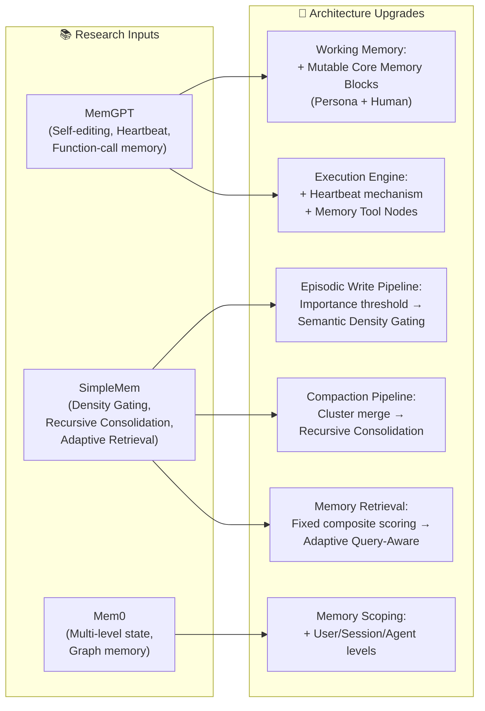

| # | Upgrade | Replaces | Source Paper | Section Updated |
|:---|:---|:---|:---|:---|
| U1 | Mutable Core Memory Blocks (Persona + Human) | Static system prompt only | MemGPT | Section 3.1 (Working Memory) |
| U2 | Heartbeat mechanism + Memory Tool Nodes | Single-pass execution only | MemGPT | Section 2.2 (Execution Engine) |
| U3 | Semantic Density Gating | `importance_score >= threshold` | SimpleMem | Section 3.3 (Episodic Write) |
| U4 | Recursive Memory Consolidation | Scheduled cluster merge | SimpleMem | Section 4.3 (Compaction) |
| U5 | Adaptive Query-Aware Retrieval | Fixed composite scoring | SimpleMem | Section 4.1 (Memory Read) |
| U6 | User/Session/Agent level scoping | Flat retrieval | Mem0 | Section 4.1 (Memory Read) |

---

## 2. System Architecture Overview

### 1.1 Service Decomposition

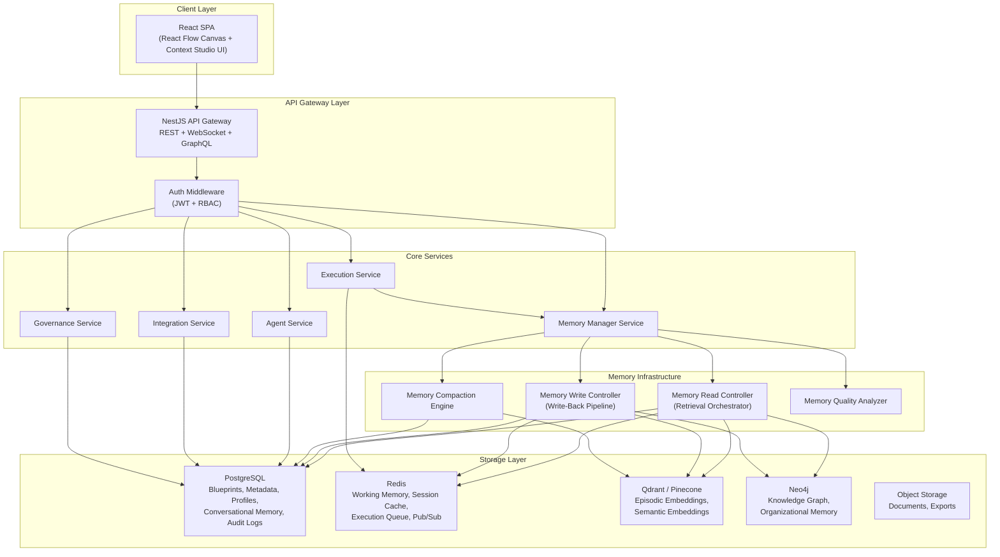

### 1.2 Data Flow — Single Agent Execution

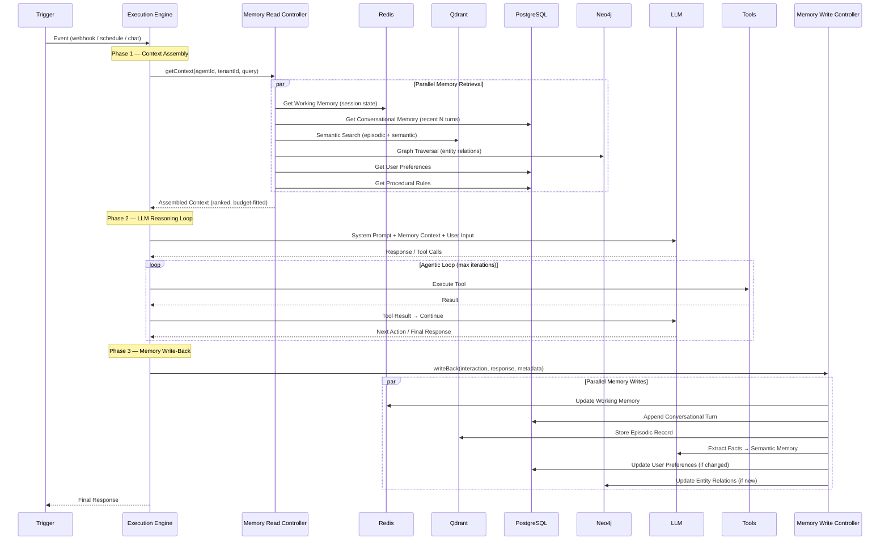

---

## 2. Memory Layer Strategies

### 2.1 Working Memory (In-Context / Ephemeral)

> **Purpose:** The agent's "RAM" — holds the active session state, reasoning scratchpad, and current context window contents.

#### Storage Strategy

| Attribute | Value |
|:---|:---|
| **Store** | Redis (hash per session) |
| **Key Pattern** | `wm:{tenantId}:{agentId}:{sessionId}` |
| **TTL** | Session duration + 30-minute grace period |
| **Max Size** | Configurable per agent (default: 16K tokens) |
| **Persistence** | Ephemeral — lost after session ends (summarized → Conversational) |

#### Data Structure

```json
{
  "sessionId": "sess_abc123",
  "agentId": "agent_xyz",
  "tenantId": "tenant_001",
  "systemPrompt": "You are a customer support agent...",
  "scratchpad": "User seems frustrated. Priority: resolve billing issue.",
  "currentGoal": "Help user understand their invoice",
  "activeTools": ["billing_api", "knowledge_search"],
  "turnCount": 7,
  "tokenBudget": {
    "total": 16000,
    "used": 11240,
    "remaining": 4760
  },
  "contextSlots": {
    "systemPrompt": 1200,
    "memoryContext": 4500,
    "conversationHistory": 3800,
    "scratchpad": 340,
    "toolResults": 1400
  }
}
```

#### Read/Write Patterns

| Operation | Trigger | Latency Target |
|:---|:---|:---|
| **Read** | Every LLM call (to assemble context window) | < 5ms (Redis GET) |
| **Write** | After every LLM turn (update scratchpad, token counts) | < 5ms (Redis SET) |
| **Evict** | Session end or TTL expiry | Automatic (Redis TTL) |
| **Overflow** | Token budget exceeded | Trigger compaction → summarize oldest turns |

#### Boundary Cases

| Case | Strategy |
|:---|:---|
| Session reconnect after disconnect | Grace period TTL (30 min); client sends `sessionId` to resume |
| Token budget exceeded mid-turn | Evict lowest-relevance memory slots first; summarize if still over |
| Concurrent writes (parallel tool calls) | Redis atomic operations (MULTI/EXEC); last-write-wins for scratchpad |
| Session crash without cleanup | TTL-based auto-expiry; orphan detection cron job every 15 min |

---

### 2.2 Conversational Memory (Cross-Session Dialogue)

> **Purpose:** Maintains dialogue continuity across turns and sessions. Enables the agent to reference what was said earlier.

#### Storage Strategy

| Attribute | Value |
|:---|:---|
| **Store** | PostgreSQL (structured) + Redis (recent buffer) |
| **Table** | `conversation_turns` |
| **Retention** | Configurable: last N turns (default 50) or last T days (default 30) |
| **Overflow Strategy** | Sliding window with summarization: oldest turns beyond window are LLM-summarized into a "conversation summary" record |

#### Schema

```sql
CREATE TABLE conversation_turns (
    id              UUID PRIMARY KEY DEFAULT gen_random_uuid(),
    tenant_id       UUID NOT NULL REFERENCES tenants(id),
    agent_id        UUID NOT NULL REFERENCES agents(id),
    session_id      UUID NOT NULL,
    user_id         UUID REFERENCES users(id),
    turn_number     INTEGER NOT NULL,
    role            VARCHAR(20) NOT NULL, -- 'user' | 'assistant' | 'system' | 'tool'
    content         TEXT NOT NULL,
    token_count     INTEGER NOT NULL,
    metadata        JSONB DEFAULT '{}',   -- tool calls, model used, latency
    created_at      TIMESTAMPTZ NOT NULL DEFAULT NOW(),
    
    CONSTRAINT unique_turn UNIQUE(session_id, turn_number)
);

CREATE INDEX idx_conv_turns_agent_session ON conversation_turns(agent_id, session_id, turn_number);
CREATE INDEX idx_conv_turns_tenant_time ON conversation_turns(tenant_id, created_at DESC);

-- Summarized conversation records (compacted from raw turns)
CREATE TABLE conversation_summaries (
    id              UUID PRIMARY KEY DEFAULT gen_random_uuid(),
    tenant_id       UUID NOT NULL,
    agent_id        UUID NOT NULL,
    session_id      UUID NOT NULL,
    summary_text    TEXT NOT NULL,
    turns_covered   INT4RANGE NOT NULL,   -- e.g., [1, 25)
    token_count     INTEGER NOT NULL,
    created_at      TIMESTAMPTZ NOT NULL DEFAULT NOW()
);
```

#### Retrieval Strategy

```
When assembling context for an LLM call:

1. Load conversation summary (if exists) → base context
2. Load last N raw turns from current session → append
3. If cross-session continuity needed:
   a. Load last session's summary
   b. Load last 3 turns from previous session
4. Fit within conversational memory token budget
```

#### Compaction Pipeline

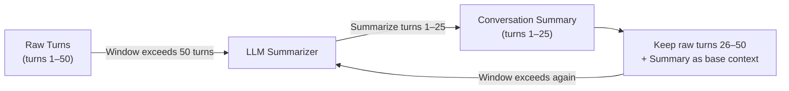

#### Boundary Cases

| Case | Strategy |
|:---|:---|
| Very long sessions (500+ turns) | Rolling summarization: summarize in chunks of 25; summaries are themselves summarized at 10 summaries |
| Multi-user conversations (group chats) | Each turn tagged with `user_id`; retrieval can filter by user or include all |
| Session resumed after days | Load previous session summary + last 3 turns; flag as "resumed session" in system prompt |
| Identical messages (user retries) | Deduplication: detect consecutive identical `user` turns; keep only latest |
| Empty turns (user sends blank) | Reject at API validation layer; never stored |
| Conversation forking (user wants to "go back") | Not supported in v1 — see Limitations section |

---

### 2.3 Episodic Memory (Event Log)

> **Purpose:** Persistent records of specific past interactions, decisions, and outcomes — the "autobiography" of the agent's experiences.

#### Storage Strategy

| Attribute | Value |
|:---|:---|
| **Store** | Qdrant (vector embeddings) + PostgreSQL (structured metadata) |
| **Embedding Model** | Configurable (default: OpenAI `text-embedding-3-small`, 1536 dims) |
| **Collection** | One Qdrant collection per tenant (namespace isolation) |
| **Retention** | Configurable TTL per tenant (default: 365 days) |
| **Decay** | Exponential decay on access score; reinforced on retrieval |

#### Data Model

```json
// Qdrant Point
{
  "id": "ep_uuid",
  "vector": [0.023, -0.118, ...],  // 1536 dims
  "payload": {
    "tenant_id": "tenant_001",
    "agent_id": "agent_xyz",
    "user_id": "user_456",
    "episode_type": "interaction",   // interaction | decision | error | milestone
    "summary": "User asked to reschedule their flight from NYC to London. Successfully rebooked to March 15.",
    "outcome": "success",            // success | failure | partial | escalated
    "entities": ["user_456", "flight_AA123", "NYC", "London"],
    "importance_score": 7,           // 1-10, LLM-assigned
    "access_count": 3,
    "last_accessed_at": "2026-06-20T10:00:00Z",
    "decay_score": 0.85,            // 0.0 (forgotten) to 1.0 (fresh)
    "source_session_id": "sess_abc",
    "created_at": "2026-06-15T14:30:00Z"
  }
}
```

#### Write Pipeline (Post-Interaction)

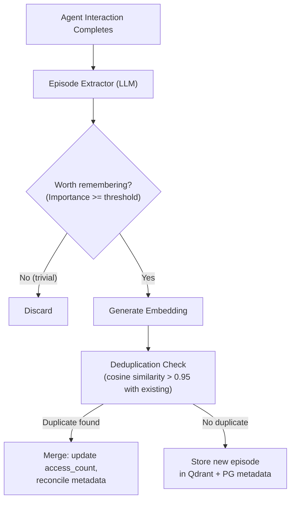

**Episode Extraction Prompt (LLM):**
```
Given this agent-user interaction, extract a concise episodic record.

Rules:
1. Summarize WHAT happened in 1-2 sentences
2. Note the OUTCOME (success/failure/partial/escalated)
3. List KEY ENTITIES involved (people, products, locations, IDs)
4. Rate IMPORTANCE from 1-10 (10 = critical business decision, 1 = trivial small talk)
5. If importance < 3, return {"skip": true}

Interaction:
{interaction_transcript}
```

#### Retrieval Strategy

```
Composite Score = (α × semantic_similarity) + (β × recency_score) + (γ × importance_score) + (δ × decay_score)

Default weights: α=0.4, β=0.2, γ=0.25, δ=0.15
Configurable per agent via Context Studio UI.

Steps:
1. Embed the current query
2. Qdrant ANN search: top 50 candidates (filtered by tenant_id + agent_id)
3. Apply composite scoring to re-rank
4. Return top K (default 5) episodes
5. Update access_count and last_accessed_at for returned episodes
6. Recalculate decay_score for accessed episodes (reinforce)
```

#### Decay Algorithm

```python
def calculate_decay(episode, current_time, half_life_days=30):
    """
    Exponential decay with access-based reinforcement.
    
    - Base decay: halves every `half_life_days` days since creation
    - Access reinforcement: each access resets the decay clock partially
    - Importance boost: high-importance memories decay slower
    """
    days_since_last_access = (current_time - episode.last_accessed_at).days
    importance_multiplier = 1 + (episode.importance_score / 10)  # 1.1 to 2.0
    
    effective_half_life = half_life_days * importance_multiplier
    decay = 0.5 ** (days_since_last_access / effective_half_life)
    
    return max(decay, 0.01)  # Floor at 0.01 — never fully forget

def should_prune(episode, threshold=0.05):
    """Prune episodes with decay below threshold AND importance < 3."""
    return episode.decay_score < threshold and episode.importance_score < 3
```

#### Boundary Cases

| Case | Strategy |
|:---|:---|
| Massive episode volume (100K+ per agent) | Qdrant handles ANN at scale; metadata pre-filtering reduces search space; periodic pruning of decayed episodes |
| Near-duplicate episodes | Cosine similarity > 0.95 during write → merge instead of create |
| Contradicting episodes | Contradiction detector flags; newer episode gets higher trust by default; surfaced in Context Studio for manual resolution |
| Episodes referencing deleted users | Right-to-be-forgotten cascade: delete all episodes where `user_id` matches; re-embed remaining if entity references are entangled |
| Embedding model change | Migration job: re-embed all episodes with new model; maintain model version in metadata; support dual-read during migration |
| Failed LLM extraction | Fallback: store raw interaction transcript as episode with `importance_score=5` (neutral); flag for manual review |

---

### 2.4 Semantic Memory (Knowledge Base / Facts)

> **Purpose:** Accumulated facts, concepts, domain rules, and structured knowledge — the agent's "education."

#### Storage Strategy

| Attribute | Value |
|:---|:---|
| **Store** | Qdrant (embeddings for semantic search) + Neo4j (knowledge graph for relationships) + PostgreSQL (structured facts table) |
| **Sources** | LLM extraction from episodes, manual curation, document ingestion, organizational imports |
| **Retention** | Permanent unless explicitly deleted or contradicted |
| **Deduplication** | Entity-centric: new facts linked to existing entities rather than stored as detached chunks |

#### Data Model — Fact Store (PostgreSQL)

```sql
CREATE TABLE semantic_facts (
    id              UUID PRIMARY KEY DEFAULT gen_random_uuid(),
    tenant_id       UUID NOT NULL,
    agent_id        UUID,                 -- NULL = shared across all agents in tenant
    
    -- Fact content
    subject         VARCHAR(500) NOT NULL, -- Entity the fact is about
    predicate       VARCHAR(200) NOT NULL, -- Relationship type
    object          TEXT NOT NULL,          -- The fact value
    fact_text        TEXT NOT NULL,          -- Natural language: "User X prefers Python"
    
    -- Quality metadata
    confidence      FLOAT NOT NULL DEFAULT 0.7,  -- 0.0 to 1.0
    source_type     VARCHAR(50) NOT NULL,         -- 'llm_extracted' | 'manual' | 'document' | 'api'
    source_ref      TEXT,                          -- Reference to source (episode ID, document URL, etc.)
    corroboration_count INTEGER DEFAULT 1,        -- How many sources confirm this fact
    
    -- Lifecycle
    status          VARCHAR(20) DEFAULT 'active', -- 'active' | 'disputed' | 'superseded' | 'archived'
    superseded_by   UUID REFERENCES semantic_facts(id),
    valid_from      TIMESTAMPTZ DEFAULT NOW(),
    valid_until     TIMESTAMPTZ,                   -- NULL = still valid
    
    created_at      TIMESTAMPTZ DEFAULT NOW(),
    updated_at      TIMESTAMPTZ DEFAULT NOW(),
    created_by      VARCHAR(50) NOT NULL           -- 'system' | user_id
);

CREATE INDEX idx_facts_subject ON semantic_facts(tenant_id, subject);
CREATE INDEX idx_facts_status ON semantic_facts(tenant_id, status);
```

#### Data Model — Knowledge Graph (Neo4j)

```cypher
// Entity nodes
CREATE (e:Entity {
    id: "ent_uuid",
    tenant_id: "tenant_001",
    name: "Acme Corp",
    type: "organization",       // person | organization | product | concept | location
    properties: {industry: "SaaS", size: "enterprise"},
    created_at: datetime()
})

// Relationship edges
CREATE (a:Entity)-[:USES {
    since: "2025-01",
    confidence: 0.9,
    source: "ep_uuid"
}]->(b:Entity)

// Example graph:
// (Acme Corp)-[:USES]->(AWS)
// (Acme Corp)-[:EMPLOYS]->(John Smith)
// (John Smith)-[:PREFERS]->(Python)
// (John Smith)-[:MANAGES]->(Project Alpha)
// (Project Alpha)-[:DEPLOYED_ON]->(AWS)
```

#### Write Pipeline — Fact Extraction

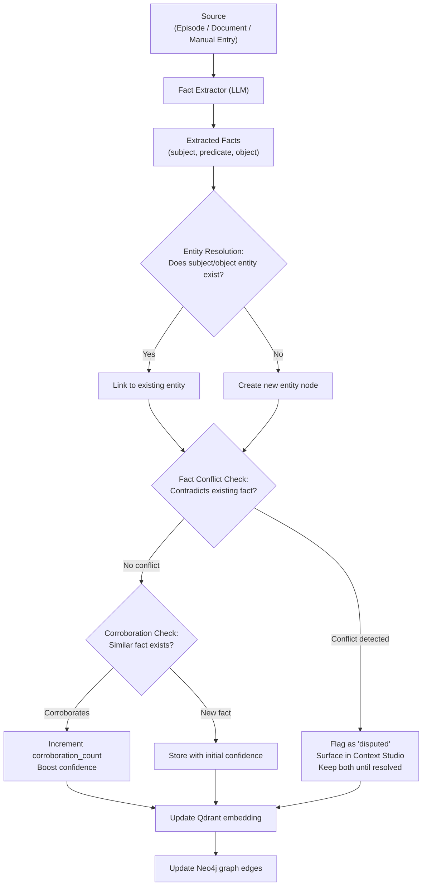

**Fact Extraction Prompt:**
```
Extract structured facts from the following text. Return JSON array.

Rules:
1. Each fact must have: subject, predicate, object, confidence (0.0-1.0)
2. Subject and object should be specific ENTITIES (people, orgs, products, concepts) — not vague references
3. Predicate should be a clear relationship verb: "uses", "prefers", "located_in", "works_at", "requires", etc.
4. Only extract facts you are >60% confident about
5. Ignore opinions, speculation, and hypotheticals
6. Resolve pronouns to actual entity names when possible

Text:
{source_text}

Context (known entities):
{existing_entity_list}
```

#### Retrieval Strategy

```
Hybrid Search:
1. VECTOR PATH: Embed query → Qdrant ANN search → top 20 fact candidates
2. GRAPH PATH: Extract entities from query → Neo4j traversal (1-2 hops) → related facts
3. KEYWORD PATH: BM25 search on fact_text in PostgreSQL → top 10 candidates
4. MERGE & RANK:
   - Combine all candidates, deduplicate by fact ID
   - Score = (0.35 × vector_score) + (0.30 × graph_relevance) + (0.20 × keyword_score) + (0.15 × confidence)
   - Return top K facts (default 10)
5. FILTER:
   - Exclude status='superseded' or status='archived'
   - Exclude facts with confidence < 0.3
   - Apply valid_from / valid_until temporal filtering
```

#### Boundary Cases

| Case | Strategy |
|:---|:---|
| Contradicting facts from different sources | Both stored; newer fact flagged with higher initial trust; `disputed` status triggers Context Studio alert; human resolves via curation UI |
| Temporal facts ("CEO is John" → "CEO is Jane") | `valid_until` set on old fact; `superseded_by` links old → new; retrieval respects temporal validity |
| Entity ambiguity ("Apple" = company or fruit?) | Entity resolution uses tenant context + entity type; if ambiguous, store with `type: 'ambiguous'` and surface for manual disambiguation |
| Fact extracted with low confidence | Stored with `confidence < 0.5`; excluded from retrieval by default; visible in Context Studio for manual verification |
| Massive knowledge base (1M+ facts) | Qdrant handles vector scale; Neo4j indexed by tenant; PostgreSQL partitioned by tenant_id |
| Circular relationships in graph | Neo4j traversal with depth limit (max 3 hops); cycle detection in query; deduplicate results |
| Facts from deleted documents | Soft-delete: mark facts as `source_deleted` status; retain if corroborated by other sources; prune if sole source |
| Cross-tenant fact contamination | Strict tenant_id filtering at every query level (Qdrant payload filter + Neo4j WHERE + PG WHERE); validated in middleware |

---

### 2.5 Procedural Memory (How-To / Behavioral Rules)

> **Purpose:** Encodes HOW the agent does things — workflows, tool-use patterns, behavioral rules, and learned procedures.

#### Storage Strategy

| Attribute | Value |
|:---|:---|
| **Store** | PostgreSQL (structured rules) + Qdrant (embedded for semantic retrieval) |
| **Format** | Structured rule definitions + natural language descriptions |
| **Sources** | Manual configuration, learned from repeated tool-use patterns, imported playbooks |
| **Scope** | Agent-level (per agent) or Tenant-level (shared across agents) |

#### Data Model

```sql
CREATE TABLE procedural_rules (
    id              UUID PRIMARY KEY DEFAULT gen_random_uuid(),
    tenant_id       UUID NOT NULL,
    agent_id        UUID,                    -- NULL = shared across tenant
    
    -- Rule definition
    name            VARCHAR(200) NOT NULL,
    description     TEXT NOT NULL,            -- Natural language: "When user asks to deploy, first run tests..."
    rule_type       VARCHAR(50) NOT NULL,     -- 'workflow' | 'behavior' | 'tool_pattern' | 'constraint' | 'escalation'
    
    -- Structured rule (machine-readable)
    trigger_condition JSONB NOT NULL,         -- When to apply this rule
    action_sequence   JSONB NOT NULL,         -- What to do (ordered steps)
    
    -- Quality
    priority        INTEGER DEFAULT 50,       -- 1-100, higher = more important
    confidence      FLOAT DEFAULT 1.0,        -- 1.0 for manual rules; learned rules start lower
    learned         BOOLEAN DEFAULT FALSE,    -- TRUE if auto-learned from patterns
    
    -- Lifecycle
    status          VARCHAR(20) DEFAULT 'active',
    version         INTEGER DEFAULT 1,
    
    created_at      TIMESTAMPTZ DEFAULT NOW(),
    updated_at      TIMESTAMPTZ DEFAULT NOW(),
    created_by      VARCHAR(50) NOT NULL
);
```

#### Example Rules

```json
// Workflow Rule
{
  "name": "Deployment Procedure",
  "rule_type": "workflow",
  "trigger_condition": {
    "intent_matches": ["deploy", "release", "push to production"],
    "context_requires": ["has_code_changes"]
  },
  "action_sequence": [
    {"step": 1, "action": "run_tool", "tool": "test_suite", "params": {}},
    {"step": 2, "action": "check_condition", "condition": "tests_passed"},
    {"step": 3, "action": "run_tool", "tool": "create_pr", "params": {"base": "main"}},
    {"step": 4, "action": "wait_for_approval", "approver": "team_lead"},
    {"step": 5, "action": "run_tool", "tool": "merge_and_deploy", "params": {}}
  ]
}

// Behavioral Constraint
{
  "name": "Never share PII",
  "rule_type": "constraint",
  "trigger_condition": {"always": true},
  "action_sequence": [
    {"step": 1, "action": "inject_system_prompt", "content": "Never reveal personal identifiable information including emails, phone numbers, SSNs, or addresses in your responses. If asked, explain that you cannot share this data."}
  ]
}

// Escalation Rule
{
  "name": "Escalate billing disputes over $1000",
  "rule_type": "escalation",
  "trigger_condition": {
    "intent_matches": ["billing dispute", "refund request", "charge dispute"],
    "context_requires": ["amount_exceeds_1000"]
  },
  "action_sequence": [
    {"step": 1, "action": "notify_human", "channel": "slack", "message": "Billing dispute over $1000 requires manual review"},
    {"step": 2, "action": "respond_to_user", "content": "I've escalated this to our billing team. They will review your case within 24 hours."},
    {"step": 3, "action": "pause_execution"}
  ]
}
```

#### Learning Pipeline (Auto-Learning from Patterns)

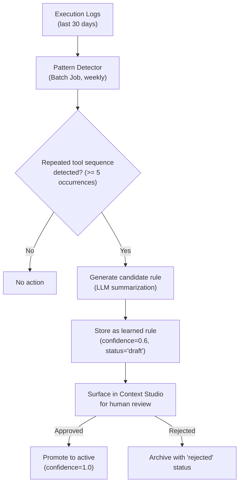

#### Retrieval Strategy

```
1. ALWAYS-ON RULES: Load all rules with trigger_condition.always = true → inject into system prompt
2. INTENT-MATCHED RULES: Match user intent against trigger_condition.intent_matches using semantic similarity
3. CONTEXT-MATCHED RULES: Check trigger_condition.context_requires against current session context
4. PRIORITY SORT: Order matched rules by priority (desc), then confidence (desc)
5. CONFLICT RESOLUTION: If two rules conflict, higher-priority wins; if same priority, manual rule beats learned rule
```

#### Boundary Cases

| Case | Strategy |
|:---|:---|
| Conflicting rules (two rules give opposite instructions) | Priority-based resolution; equal priority → manual rule wins; surface conflict in Context Studio |
| Learned rule is wrong | Human review gate: learned rules start as `draft`; require approval before `active`; auto-rejected if < 3 approvals in 30 days |
| Rule explosion (too many rules for context window) | Only top-K rules by relevance injected; always-on rules have reserved budget; overflow → summarize secondary rules |
| Circular rule dependencies | Execution engine tracks rule chain depth; max depth = 5; circular reference → halt and log error |
| Rule versioning conflicts | Each rule has `version` counter; updates create new version; rollback to any previous version |

---

### 2.6 User Preference Memory (Personalization Profile)

> **Purpose:** Persistent profile of user communication style, technical level, format preferences, and behavioral patterns.

#### Storage Strategy

| Attribute | Value |
|:---|:---|
| **Store** | PostgreSQL (structured profile) |
| **Scope** | Per user per tenant (a user may have different preferences in different workspaces) |
| **Update Frequency** | After each interaction (incremental); full recalculation weekly |
| **Sources** | Derived from episodic memory patterns + explicit user settings |

#### Data Model

```sql
CREATE TABLE user_preferences (
    id              UUID PRIMARY KEY DEFAULT gen_random_uuid(),
    tenant_id       UUID NOT NULL,
    user_id         UUID NOT NULL,
    
    -- Communication preferences
    response_style  VARCHAR(50) DEFAULT 'balanced',   -- 'concise' | 'balanced' | 'detailed'
    technical_level VARCHAR(50) DEFAULT 'intermediate', -- 'beginner' | 'intermediate' | 'expert'
    tone            VARCHAR(50) DEFAULT 'professional', -- 'casual' | 'professional' | 'formal'
    language        VARCHAR(10) DEFAULT 'en',
    
    -- Format preferences
    preferred_format JSONB DEFAULT '{}',  -- {"code": "python", "output": "markdown", "lists": "bullet"}
    
    -- Behavioral patterns (auto-derived)
    common_topics   JSONB DEFAULT '[]',   -- ["billing", "deployment", "data_analysis"]
    active_hours    JSONB DEFAULT '{}',   -- {"timezone": "America/New_York", "peak": "09:00-17:00"}
    avg_session_length INTEGER,           -- in minutes
    
    -- Explicit settings (user-configured)
    explicit_prefs  JSONB DEFAULT '{}',   -- User-defined overrides
    
    -- Confidence tracking
    interaction_count INTEGER DEFAULT 0,
    confidence      FLOAT DEFAULT 0.3,    -- Increases with more interactions
    last_recalculated_at TIMESTAMPTZ,
    
    created_at      TIMESTAMPTZ DEFAULT NOW(),
    updated_at      TIMESTAMPTZ DEFAULT NOW(),
    
    CONSTRAINT unique_user_tenant UNIQUE(tenant_id, user_id)
);
```

#### Preference Derivation Pipeline

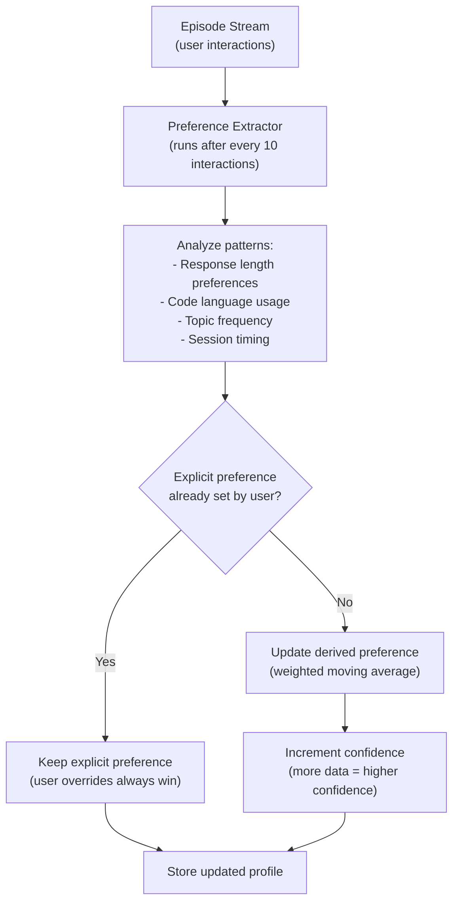

#### Retrieval

```
Simple direct lookup: SELECT * FROM user_preferences WHERE tenant_id = ? AND user_id = ?
Injected into system prompt as structured context block.
Latency target: < 10ms (single indexed PG query; cached in Redis for active sessions).
```

#### Boundary Cases

| Case | Strategy |
|:---|:---|
| New user with no history | Default profile applied; confidence = 0.3; agent behaves generically until enough data gathered |
| User preferences conflict with organizational rules | Organizational rules always override user preferences (e.g., org requires formal tone) |
| User explicitly changes preference that was auto-derived | Explicit preference stored separately; always wins; derived value preserved for reference |
| User has different preferences across agents | Preferences are per-user-per-tenant; if per-agent needed, extend schema with `agent_id` (future) |
| Preference drift (user style changes over time) | Weighted moving average favors recent interactions; full recalculation weekly |

---

### 2.7 Organizational Memory (Governed Knowledge)

> **Purpose:** Business glossaries, data lineage, policies, compliance rules, and domain definitions that are authoritative and version-controlled.

#### Storage Strategy

| Attribute | Value |
|:---|:---|
| **Store** | PostgreSQL (version-controlled documents) + Neo4j (relationship graph) + Qdrant (semantic search) |
| **Governance** | Admin-only write access; review & publish workflow; immutable audit trail |
| **Sources** | Admin curation, document ingestion, API sync from external systems |
| **Scope** | Tenant-level (shared across all agents in tenant) |

#### Data Model

```sql
CREATE TABLE org_knowledge (
    id              UUID PRIMARY KEY DEFAULT gen_random_uuid(),
    tenant_id       UUID NOT NULL,
    
    -- Content
    category        VARCHAR(100) NOT NULL,  -- 'glossary' | 'policy' | 'metric_definition' | 'process' | 'compliance' | 'data_lineage'
    title           VARCHAR(500) NOT NULL,
    content         TEXT NOT NULL,
    
    -- Versioning
    version         INTEGER NOT NULL DEFAULT 1,
    version_hash    VARCHAR(64) NOT NULL,   -- SHA-256 of content for change detection
    published       BOOLEAN DEFAULT FALSE,
    published_at    TIMESTAMPTZ,
    published_by    UUID,
    
    -- Metadata
    tags            TEXT[] DEFAULT '{}',
    applies_to      UUID[],                 -- List of agent_ids this knowledge applies to (empty = all)
    
    -- Lifecycle
    status          VARCHAR(20) DEFAULT 'draft', -- 'draft' | 'review' | 'published' | 'deprecated'
    review_notes    TEXT,
    
    created_at      TIMESTAMPTZ DEFAULT NOW(),
    updated_at      TIMESTAMPTZ DEFAULT NOW(),
    created_by      UUID NOT NULL
);

-- Version history (immutable log)
CREATE TABLE org_knowledge_history (
    id              UUID PRIMARY KEY DEFAULT gen_random_uuid(),
    knowledge_id    UUID NOT NULL REFERENCES org_knowledge(id),
    version         INTEGER NOT NULL,
    content         TEXT NOT NULL,
    changed_by      UUID NOT NULL,
    change_reason   TEXT,
    created_at      TIMESTAMPTZ DEFAULT NOW()
);
```

#### Governance Workflow

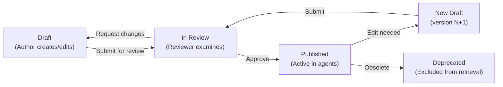

#### Retrieval

```
1. Only `status = 'published'` records are included in agent context
2. Filtered by `applies_to` (if specified) or included for all agents
3. Semantic search via Qdrant for query-relevant organizational knowledge
4. Graph traversal via Neo4j for related policies/definitions
5. Highest priority in context assembly (organizational > semantic > episodic)
```

#### Boundary Cases

| Case | Strategy |
|:---|:---|
| Conflicting org knowledge and agent-level semantic facts | Org knowledge always wins; agent facts flagged as `overridden_by_org` |
| Bulk import from external system (e.g., Confluence) | Batch ingestion pipeline with progress tracking; deduplication against existing entries; review queue for ambiguous imports |
| Multiple versions in review simultaneously | Only one draft version per knowledge entry allowed; new edit blocks until current review resolved |
| Org knowledge references deleted entities | Broken reference detector (weekly batch job); flagged in Context Studio for admin action |
| Large policy documents (100+ pages) | Chunked storage: split into sections; each section independently embedded and retrievable; parent document maintains section ordering |

---

## 3. Memory Pipeline Architecture

### 3.1 Unified Memory Read Pipeline

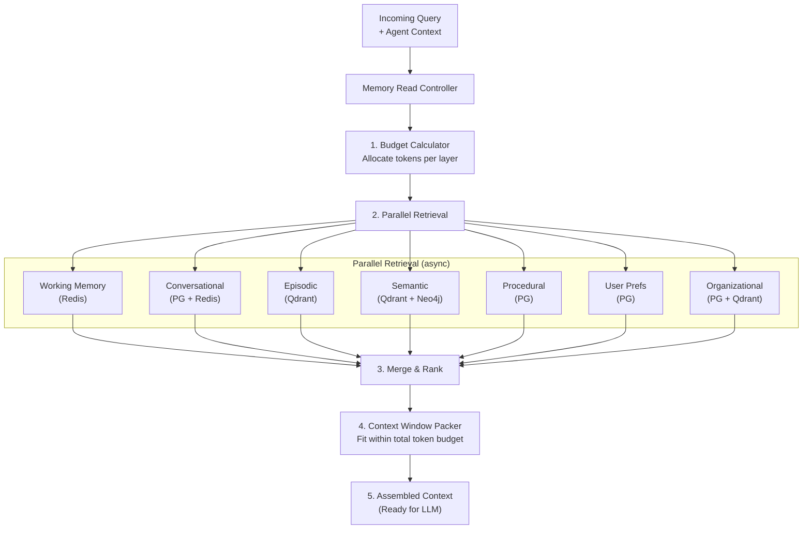

#### Token Budget Allocation (Default)

| Layer | Budget % | Priority | Eviction Order |
|:---|:---|:---|:---|
| System Prompt | 10% | 1 (highest) | Never evicted |
| Organizational Memory | 10% | 2 | Last to be evicted |
| Procedural Rules (always-on) | 8% | 3 | Reduce to critical-only |
| User Preferences | 3% | 4 | Compress to key items |
| Conversational (recent turns) | 30% | 5 | Summarize older turns |
| Semantic Facts | 18% | 6 | Reduce K results |
| Episodic Memories | 13% | 7 | Reduce K results |
| Tool Results / Scratchpad | 8% | 8 | Truncate oldest |

> Budgets are configurable per agent in the Context Studio UI.

### 3.2 Unified Memory Write-Back Pipeline

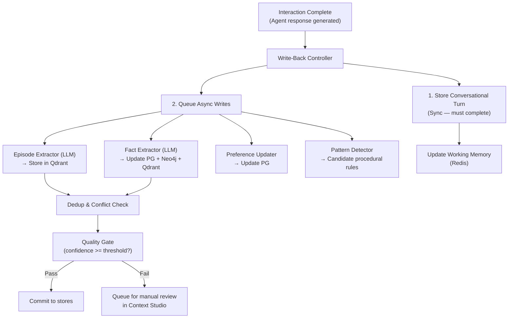

### 3.3 Memory Compaction Pipeline (Scheduled)

```
Runs: Every 6 hours (configurable per tenant)

Steps:
1. CONVERSATIONAL COMPACTION
   - Find sessions with > max_raw_turns (default 50)
   - Summarize oldest 50% of turns → conversation_summary
   - Delete raw turns covered by summary

2. EPISODIC CONSOLIDATION
   - Find episodes with decay_score < prune_threshold (default 0.05) AND importance < 3
   - Batch delete pruned episodes from Qdrant + PG
   - Find episode clusters (cosine similarity > 0.85)
   - Merge clusters into single consolidated episode

3. SEMANTIC DEDUPLICATION
   - Find facts with identical (subject, predicate) pairs
   - Merge: keep highest confidence; update corroboration_count
   - Flag contradictions for Context Studio review

4. STATISTICS UPDATE
   - Recalculate decay scores for all episodes
   - Update user preference confidence scores
   - Generate memory health metrics for monitoring dashboard
```

---

## 4. Boundary Cases — Handled

### Category A: Memory Lifecycle

| # | Case | Handling |
|:---|:---|:---|
| A1 | **Cold start** — Agent has zero memories | Graceful degradation: agent operates with system prompt + org knowledge only; no errors; gradually builds memory |
| A2 | **Memory overflow** — Single layer exceeds storage quota | Per-layer storage quotas with soft/hard limits; soft = alert in Context Studio; hard = auto-prune lowest-value entries |
| A3 | **Stale memories dominating retrieval** | Decay algorithm reduces stale memory scores; compaction pipeline prunes; staleness indicator in Context Studio |
| A4 | **Rapid memory accumulation** (chatty agent) | Rate limiter on write-back pipeline: max 10 episodic writes/minute per agent; excess queued for batch processing |
| A5 | **Memory migration** between agents | Export/import API for all memory layers; JSON + embedding vector format; re-indexing on import |

### Category B: Retrieval Edge Cases

| # | Case | Handling |
|:---|:---|:---|
| B1 | **Query matches no memories** | Return empty context for that layer; agent proceeds without it; log as "no memory hit" for analytics |
| B2 | **Too many relevant memories** (context overflow) | Budget-based truncation: rank all candidates, fit within token budget, drop lowest-scored |
| B3 | **Retrieval latency spike** (slow vector DB) | 500ms timeout per retrieval call; circuit breaker after 3 consecutive failures; graceful degradation (skip that layer) |
| B4 | **Embedding service down** | Cached embeddings used for existing queries; new content queued for later embedding; alert to admin |
| B5 | **Semantic search returns irrelevant results** | Minimum similarity threshold (default 0.65); below threshold = treated as no match; tunable in Context Studio |

### Category C: Multi-Tenancy

| # | Case | Handling |
|:---|:---|:---|
| C1 | **Cross-tenant data leak** | Every query enforces `tenant_id` filter at storage level (Qdrant payload filter, PG WHERE clause, Neo4j WHERE); middleware validation as secondary check |
| C2 | **Tenant exceeds resource quota** | Per-tenant quotas: max memories, max storage, max daily LLM calls; soft limit = throttle + alert; hard limit = block writes |
| C3 | **Tenant deletion** | Cascade delete: all agents, memories, credentials, execution history; async job with progress tracking; irreversible after 30-day grace period |
| C4 | **Tenant data export (GDPR)** | Full data export API: all memories in JSON format with embeddings; audit log included; generated within 72 hours |

### Category D: Concurrency

| # | Case | Handling |
|:---|:---|:---|
| D1 | **Simultaneous writes to same memory** | Optimistic locking with `version` field; conflict → retry with merge; max 3 retries then fail |
| D2 | **Read during compaction** | Compaction uses copy-on-write: old data readable until new data committed; atomic swap |
| D3 | **Multiple agents writing to shared semantic memory** | Write serialization via Redis distributed lock; 5-second lock timeout; conflict detection on release |
| D4 | **Parallel tool calls updating working memory** | Redis MULTI/EXEC for atomic updates; each tool result appended (not overwritten) |

### Category E: Data Integrity

| # | Case | Handling |
|:---|:---|:---|
| E1 | **Corrupted embedding vector** | Checksum validation on write; dimension mismatch detection; auto-re-embed on corruption detection |
| E2 | **LLM hallucination in fact extraction** | Confidence scoring on extraction; low-confidence facts (`< 0.5`) stored but excluded from retrieval; surfaced for review |
| E3 | **Orphaned data** (memory references deleted entities) | Weekly orphan detection batch job; orphaned records flagged in Context Studio; auto-archived after 90 days |
| E4 | **Character encoding issues** | UTF-8 enforced at API layer; sanitization on input; mojibake detection and alert |

### Category F: Scale

| # | Case | Handling |
|:---|:---|:---|
| F1 | **10K+ concurrent sessions** | Redis cluster for working memory; PG read replicas for conversational; Qdrant horizontal scaling |
| F2 | **1M+ memories per tenant** | Qdrant HNSW index handles scale; PG table partitioning by `tenant_id`; Neo4j index by tenant |
| F3 | **Embedding model upgrade** | Dual-index strategy: new queries embed with new model; background re-embed job; cutover when complete |
| F4 | **Database failover** | PG streaming replication with auto-failover; Redis Sentinel/Cluster; Qdrant replicated collections |

### Category G: Security

| # | Case | Handling |
|:---|:---|:---|
| G1 | **Prompt injection into memory** | Input sanitization on write; LLM-based content moderation filter; suspicious content flagged, not auto-stored |
| G2 | **PII accidentally stored** | PII detection scanner (batch + real-time); auto-redaction option; admin alert in Context Studio |
| G3 | **Memory access by unauthorized user** | RBAC enforcement: users see only their agent's memories; admins see tenant-level; super admins see all |
| G4 | **Credential exposure in memory** | Pattern detection for API keys, passwords, tokens; auto-redact and alert; never stored in plain text |

### Category H: Agent Orchestration

| # | Case | Handling |
|:---|:---|:---|
| H1 | **Infinite agent reasoning loop** | Max iteration limit per execution (default 25); timeout per execution (default 300s); force-terminate and log |
| H2 | **Sub-agent fails** | Parent agent receives error; configurable: retry, skip, or escalate; failure logged as episode |
| H3 | **Agent attempts to access tools it doesn't have** | Tool whitelist per agent; unauthorized tool calls rejected with clear error; logged for audit |
| H4 | **Circular agent delegation** (A calls B calls A) | Delegation depth tracker; max depth = 5; circular reference detection → halt with error |

---

## 5. Cases NOT Handled — Explicit Limitations

> [!CAUTION]
> The following cases are **explicitly out of scope** for v1. They are documented here for transparency and future roadmap consideration.

### Memory Limitations

| # | Limitation | Why Not Handled | Future Consideration |
|:---|:---|:---|:---|
| L1 | **Real-time streaming memory updates** — Memory updates visible to other agents within milliseconds | Adds significant complexity to consistency model; write-back pipeline is async (seconds, not ms) | v2: Event-driven memory bus with pub/sub |
| L2 | **Cross-tenant shared memory** — Two tenants sharing a knowledge base | Security and isolation complexity; potential data leakage vector | v2: Read-only shared knowledge libraries with explicit opt-in |
| L3 | **Multi-modal memory** — Storing and retrieving images, audio, video as memories | Requires multi-modal embedding models and significantly more storage; text-only in v1 | v2: Multi-modal embeddings (CLIP, etc.) |
| L4 | **Conversation forking/branching** — "Go back to turn 5 and try a different response" | Requires tree-structured conversation history; significant UI and storage complexity | v3: Conversation tree with branch selection |
| L5 | **Causal reasoning over memories** — "Why did X happen? Trace the chain of events" | Requires causal inference beyond simple graph traversal; active research area | v3: Causal memory graphs |
| L6 | **Memory-level access control** — Different users can see different subsets of an agent's memory | RBAC is at agent/workspace level, not at individual memory entry level | v2: Fine-grained memory ACLs |
| L7 | **Federated memory** — Agent queries memory across multiple independent deployments | Requires federation protocol, trust framework, and network coordination | v3+: Federated memory protocol |
| L8 | **Automatic memory correction** — System autonomously fixes incorrect memories without human review | Risk of cascading errors; human-in-the-loop required for corrections in v1 | v2: Auto-correction with confidence thresholds and undo |

### Platform Limitations

| # | Limitation | Why Not Handled | Future Consideration |
|:---|:---|:---|:---|
| L9 | **Visual debugging of memory retrieval** — Step-through debugger showing which memories were retrieved and why, in real-time on canvas | Complex UI; requires tight integration between canvas and memory service | v2: Memory trace overlay on canvas |
| L10 | **Natural language agent creation** — "Build me an agent that handles refunds" → full agent auto-generated | Requires sophisticated code generation and testing pipeline; out of scope for builder platform | v2: AI-assisted agent scaffolding (template suggestion, not full generation) |
| L11 | **Mobile-native agent builder** — Full canvas editing on mobile devices | Touch-based node editing is poor UX; monitoring only on mobile | No plans: desktop-first design decision |
| L12 | **Offline execution** — Agents running without internet/LLM connectivity | Agents depend on LLM APIs; offline requires local models; different architecture | v3: Local LLM support (Ollama integration) |
| L13 | **Agent marketplace with billing** — Sell agents to other tenants with revenue sharing | Requires payment processing, licensing, revenue splitting; business complexity | v2: Marketplace with free sharing; v3: paid marketplace |
| L14 | **Custom embedding model training** — Train domain-specific embedding models from within the platform | Requires ML training infrastructure; out of scope for agent builder | Not planned: recommend using pre-trained or externally fine-tuned models |
| L15 | **End-to-end encryption of memory** — Zero-knowledge encryption where platform cannot read stored memories | Incompatible with server-side LLM processing, compaction, and search; fundamental architectural conflict | Not feasible with current LLM architecture |
| L16 | **Guaranteed exactly-once execution** — No duplicate executions under any failure scenario | At-least-once with idempotency keys is achievable; true exactly-once requires distributed consensus overhead | v2: Enhanced idempotency with deduplication window |
| L17 | **Sub-second memory write-back** — Guarantee that memories extracted from one interaction are available for the very next query | Write-back is async; 2-5 second delay typical; working memory is instant but episodic/semantic have latency | v2: Priority write-back queue for critical facts |
| L18 | **Agent self-modification** — Agent modifies its own workflow/blueprint at runtime | Dangerous: agents could break themselves; requires sophisticated safety guardrails | v3: Sandboxed self-modification with approval gates |

---

## 6. Phase-by-Phase Implementation

### Phase 1 — Foundation (Weeks 1–12)

#### Sprint 1–2: Project Scaffolding & Core Infrastructure

```
Week 1-2 Deliverables:
├── Monorepo setup (Nx or Turborepo)
│   ├── apps/
│   │   ├── web/              (React + Vite frontend)
│   │   └── api/              (NestJS backend)
│   ├── packages/
│   │   ├── shared-types/     (TypeScript interfaces)
│   │   ├── memory-sdk/       (Memory service client)
│   │   └── ui-components/    (Design system)
│   └── infrastructure/
│       ├── docker-compose.yml
│       └── database/migrations/
├── PostgreSQL schema (core tables)
├── Redis setup (session cache + queue)
├── Authentication (JWT + refresh tokens)
├── CI/CD pipeline (lint, test, build, deploy)
└── Development environment (Docker Compose)
```

**Core Database Tables (Phase 1):**
- `tenants` — Multi-tenant support
- `users` — User accounts
- `agents` — Agent blueprints
- `agent_versions` — Blueprint version history
- `credentials` — Encrypted credential store
- `conversation_turns` — Conversational memory
- `conversation_summaries` — Compacted conversations
- `execution_logs` — Execution history

#### Sprint 3–4: Visual Agent Builder (Canvas MVP)

```
Deliverables:
├── React Flow canvas integration
│   ├── Custom node components (Trigger, Action, Logic, AI, Code)
│   ├── Edge routing with directional arrows
│   ├── Node configuration sidebar panel
│   ├── Canvas controls (zoom, pan, minimap, snap-to-grid)
│   └── Blueprint serialization (Canvas ↔ JSON)
├── Node types (Phase 1 set):
│   ├── Triggers: Manual, Webhook, Schedule (cron)
│   ├── AI: LLM Call (OpenAI, Anthropic, Gemini)
│   ├── Logic: IF/ELSE, Merge
│   ├── Actions: HTTP Request
│   └── Code: JavaScript (V8 isolate sandbox)
├── Blueprint save/load/version API
└── Test execution (manual trigger → run → view results)
```

#### Sprint 5–6: Basic Execution Engine + Working & Conversational Memory

```
Deliverables:
├── Synchronous Execution Engine
│   ├── Blueprint parser → execution DAG
│   ├── Node executor (per node type)
│   ├── Data routing between nodes (JSON items)
│   ├── Error handling (retry, skip, fail)
│   └── Execution logging (input/output per node)
├── Working Memory (Redis)
│   ├── Session state management
│   ├── Token budget tracking
│   ├── TTL-based cleanup
│   └── Scratchpad read/write
├── Conversational Memory (PostgreSQL)
│   ├── Turn storage and retrieval
│   ├── Sliding window (last N turns)
│   ├── Basic summarization (LLM-based)
│   └── Cross-session summary loading
├── Basic credential vault (API Key, Bearer Token)
└── 10 pre-built connectors
```

---

### Phase 2 — Memory & Intelligence (Weeks 13–24)

#### Sprint 7–8: Episodic Memory + Vector DB Integration

```
Deliverables:
├── Qdrant / Pinecone integration
│   ├── Collection management (per tenant)
│   ├── Embedding pipeline (configurable model)
│   ├── ANN search with metadata filtering
│   └── Batch operations (bulk embed, bulk delete)
├── Episodic Memory Layer
│   ├── Episode extraction pipeline (LLM-based)
│   ├── Importance scoring
│   ├── Deduplication (cosine similarity check)
│   ├── Decay algorithm implementation
│   └── Write-back pipeline (async, queue-based)
├── Memory Read Controller v1
│   ├── Parallel retrieval across layers
│   ├── Basic composite scoring
│   └── Token budget allocation
└── Context Studio MVP
    ├── Memory Explorer (list/filter/search across layers)
    ├── Manual memory CRUD operations
    └── Memory statistics dashboard
```

#### Sprint 9–10: Semantic Memory + Knowledge Graph

```
Deliverables:
├── Semantic Fact Store (PostgreSQL)
│   ├── Fact CRUD API
│   ├── Fact extraction pipeline (LLM-based)
│   ├── Confidence scoring
│   ├── Corroboration tracking
│   ├── Temporal validity (valid_from, valid_until)
│   └── Contradiction detection (basic: same subject+predicate, different object)
├── Neo4j Knowledge Graph
│   ├── Entity node management
│   ├── Relationship edge management
│   ├── Entity resolution (link new facts to existing entities)
│   ├── Graph traversal queries (1-2 hop)
│   └── Tenant isolation in graph
├── Hybrid Retrieval Pipeline
│   ├── Vector search path (Qdrant)
│   ├── Graph path (Neo4j traversal)
│   ├── Keyword path (PG BM25)
│   └── Merge & rank algorithm
└── Context Studio: Entity Graph Visualization
    ├── Interactive graph view (D3.js / vis.js)
    ├── Entity detail panel
    └── Relationship explorer
```

#### Sprint 11–12: Procedural & User Preference Memory + AI Agent Node

```
Deliverables:
├── Procedural Memory
│   ├── Rule CRUD API
│   ├── Rule matching engine (intent + context conditions)
│   ├── Priority-based conflict resolution
│   ├── Learned rule pipeline (pattern detection — basic)
│   └── Rule injection into system prompt
├── User Preference Memory
│   ├── Profile CRUD API
│   ├── Preference derivation pipeline
│   ├── Explicit vs. derived preference handling
│   └── Profile injection into system prompt
├── AI Agent Node (Canvas)
│   ├── LLM + Memory + Tools orchestration
│   ├── Agentic reasoning loop (think → act → observe)
│   ├── Tool invocation framework
│   ├── Max iteration / timeout safeguards
│   └── Streaming response support (WebSocket/SSE)
├── Queue-based Execution Engine
│   ├── Redis queue with worker processes
│   ├── Concurrent execution support
│   └── Execution priority levels
└── 30 additional connectors
```

---

### Phase 3 — Governance & Scale (Weeks 25–36)

#### Sprint 13–14: Context Studio Advanced Features

```
Deliverables:
├── Memory Quality Analyzer
│   ├── Contradiction detector (LLM-powered scan)
│   ├── Staleness indicator (configurable thresholds)
│   ├── Coverage gap analysis (domain vs. memory coverage)
│   ├── Confidence scoring dashboard
│   └── Agent confusion surface (low-confidence response analysis)
├── Memory Curation Tools
│   ├── Bulk operations (select, edit, tag, delete)
│   ├── Memory merge UI
│   ├── Memory split UI
│   ├── Import/export (CSV, JSON, Markdown, PDF)
│   └── Context Sandbox (test memory changes against sample queries)
├── Memory Retrieval Configuration UI
│   ├── Weight sliders (recency, importance, similarity, decay)
│   ├── Per-layer token budget allocation
│   ├── Decay curve visualization and configuration
│   └── Retrieval policy editor (per agent)
└── Context Studio: Timeline View + Heatmap
```

#### Sprint 15–16: Organizational Memory + Governance

```
Deliverables:
├── Organizational Memory
│   ├── Knowledge CRUD with version control
│   ├── Review & publish workflow (draft → review → published)
│   ├── Bulk document ingestion pipeline
│   ├── Chunking strategy for large documents
│   └── Priority in context assembly (org > semantic > episodic)
├── RBAC System
│   ├── Role definitions (Viewer, Builder, Context Engineer, Admin)
│   ├── Custom role creation
│   ├── Permission scoping (workspace, agent, memory layer)
│   └── SSO integration (SAML 2.0, OIDC via Keycloak)
├── Audit Logging
│   ├── Immutable audit trail for all actions
│   ├── Search and filter UI
│   ├── Export to external SIEM
│   └── Configurable retention policies
└── Multi-Tenancy Hardening
    ├── Workspace isolation verification
    ├── Per-tenant resource quotas
    ├── Tenant provisioning / deprovisioning
    └── Data isolation audit (automated test suite)
```

#### Sprint 17–18: Compliance, Monitoring & Multi-Agent

```
Deliverables:
├── Compliance Tools
│   ├── PII detection scanner (regex + NER model)
│   ├── Auto-redaction pipeline
│   ├── Right-to-be-forgotten (cascade delete across all layers)
│   ├── Data export API (GDPR Article 15)
│   └── Data residency configuration
├── Monitoring Dashboard
│   ├── Real-time execution status (active, queued, completed, failed)
│   ├── Agent analytics (success rate, latency, cost)
│   ├── Memory health metrics (size, retrieval hit rate, decay distribution)
│   ├── Token usage and cost tracking
│   └── Alerting (Slack, email, webhook)
├── Multi-Agent Orchestration
│   ├── Manager → sub-agent delegation on canvas
│   ├── Agent-to-agent communication channels
│   ├── Parallel agent execution with join
│   ├── Nested workflows as tools
│   └── Delegation depth and cycle detection
└── Memory A/B Testing Framework
    ├── Parallel memory configurations
    ├── Response comparison UI
    └── Statistical significance metrics
```

---

### Phase 4 — Ecosystem & Polish (Weeks 37–48)

```
Deliverables:
├── Marketplace
│   ├── Agent template sharing
│   ├── Custom node publishing
│   ├── Search, categories, ratings
│   └── One-click import and customize
├── Custom Node SDK
│   ├── TypeScript SDK with documentation
│   ├── Node definition schema
│   ├── Hot-reload development server
│   └── Testing utilities
├── Memory Compaction Engine (Production)
│   ├── Scheduled compaction pipeline (configurable per tenant)
│   ├── Episodic consolidation (cluster merge)
│   ├── Semantic deduplication
│   ├── Memory versioning (git-style history for entries)
│   └── Compaction metrics and dashboards
├── Performance Optimization
│   ├── Canvas load < 2 seconds
│   ├── Memory retrieval < 300ms p95
│   ├── Connection pooling optimization
│   ├── Caching layer (Redis) for hot memory paths
│   └── Load testing (10K concurrent sessions target)
├── Polish
│   ├── Onboarding tutorial (interactive, < 10 min)
│   ├── In-app documentation and contextual help
│   ├── Keyboard shortcuts for power users
│   ├── Mobile-responsive monitoring (read-only)
│   ├── WCAG 2.1 AA accessibility compliance
│   └── Internationalization (i18n) foundation
└── Security & Compliance
    ├── Penetration testing
    ├── SOC 2 Type II preparation
    ├── Security audit remediation
    └── Bug bounty program setup
```

---

## 7. Database Schemas

### Complete PostgreSQL Schema (All Phases)

```sql
-- ============================================================
-- CORE TABLES
-- ============================================================

CREATE TABLE tenants (
    id              UUID PRIMARY KEY DEFAULT gen_random_uuid(),
    name            VARCHAR(200) NOT NULL,
    slug            VARCHAR(100) UNIQUE NOT NULL,
    plan            VARCHAR(50) DEFAULT 'free',       -- free | starter | pro | enterprise
    quotas          JSONB DEFAULT '{}',                -- {max_agents, max_memories, max_executions_day}
    settings        JSONB DEFAULT '{}',
    created_at      TIMESTAMPTZ DEFAULT NOW(),
    updated_at      TIMESTAMPTZ DEFAULT NOW()
);

CREATE TABLE users (
    id              UUID PRIMARY KEY DEFAULT gen_random_uuid(),
    tenant_id       UUID NOT NULL REFERENCES tenants(id),
    email           VARCHAR(255) NOT NULL,
    password_hash   VARCHAR(255),
    display_name    VARCHAR(200),
    role            VARCHAR(50) DEFAULT 'builder',     -- viewer | builder | context_engineer | admin | super_admin
    sso_provider    VARCHAR(100),
    sso_subject     VARCHAR(255),
    last_login_at   TIMESTAMPTZ,
    created_at      TIMESTAMPTZ DEFAULT NOW(),
    CONSTRAINT unique_email_tenant UNIQUE(tenant_id, email)
);

-- ============================================================
-- AGENT TABLES
-- ============================================================

CREATE TABLE agents (
    id              UUID PRIMARY KEY DEFAULT gen_random_uuid(),
    tenant_id       UUID NOT NULL REFERENCES tenants(id),
    name            VARCHAR(200) NOT NULL,
    description     TEXT,
    blueprint       JSONB NOT NULL,                    -- Serialized canvas (nodes + edges)
    status          VARCHAR(20) DEFAULT 'draft',       -- draft | active | paused | archived
    current_version INTEGER DEFAULT 1,
    
    -- Memory configuration
    memory_config   JSONB DEFAULT '{                   
        "working": {"enabled": true, "token_budget_pct": 8},
        "conversational": {"enabled": true, "max_turns": 50, "token_budget_pct": 30},
        "episodic": {"enabled": true, "decay_half_life_days": 30, "token_budget_pct": 13},
        "semantic": {"enabled": true, "min_confidence": 0.5, "token_budget_pct": 18},
        "procedural": {"enabled": true, "token_budget_pct": 8},
        "user_preference": {"enabled": true, "token_budget_pct": 3},
        "organizational": {"enabled": true, "token_budget_pct": 10}
    }',
    
    -- Execution config
    execution_config JSONB DEFAULT '{
        "max_iterations": 25,
        "timeout_seconds": 300,
        "retry_policy": {"max_retries": 3, "backoff_ms": 1000}
    }',
    
    created_by      UUID REFERENCES users(id),
    created_at      TIMESTAMPTZ DEFAULT NOW(),
    updated_at      TIMESTAMPTZ DEFAULT NOW()
);

CREATE TABLE agent_versions (
    id              UUID PRIMARY KEY DEFAULT gen_random_uuid(),
    agent_id        UUID NOT NULL REFERENCES agents(id),
    version         INTEGER NOT NULL,
    blueprint       JSONB NOT NULL,
    memory_config   JSONB NOT NULL,
    changelog       TEXT,
    created_by      UUID REFERENCES users(id),
    created_at      TIMESTAMPTZ DEFAULT NOW(),
    CONSTRAINT unique_agent_version UNIQUE(agent_id, version)
);

-- ============================================================
-- CREDENTIAL TABLES
-- ============================================================

CREATE TABLE credentials (
    id              UUID PRIMARY KEY DEFAULT gen_random_uuid(),
    tenant_id       UUID NOT NULL REFERENCES tenants(id),
    name            VARCHAR(200) NOT NULL,
    type            VARCHAR(50) NOT NULL,              -- api_key | oauth2 | basic | bearer | jwt
    encrypted_data  BYTEA NOT NULL,                    -- Envelope-encrypted credential data
    metadata        JSONB DEFAULT '{}',                -- Non-sensitive metadata (provider, scopes)
    created_by      UUID REFERENCES users(id),
    created_at      TIMESTAMPTZ DEFAULT NOW(),
    updated_at      TIMESTAMPTZ DEFAULT NOW()
);

-- ============================================================
-- EXECUTION TABLES
-- ============================================================

CREATE TABLE executions (
    id              UUID PRIMARY KEY DEFAULT gen_random_uuid(),
    tenant_id       UUID NOT NULL REFERENCES tenants(id),
    agent_id        UUID NOT NULL REFERENCES agents(id),
    agent_version   INTEGER NOT NULL,
    session_id      UUID,
    user_id         UUID REFERENCES users(id),
    
    status          VARCHAR(20) NOT NULL,              -- queued | running | completed | failed | timeout | cancelled
    trigger_type    VARCHAR(50) NOT NULL,              -- manual | webhook | schedule | chat | agent_delegation
    
    -- Timing
    started_at      TIMESTAMPTZ,
    completed_at    TIMESTAMPTZ,
    duration_ms     INTEGER,
    
    -- Results
    node_results    JSONB DEFAULT '[]',                -- Per-node execution results
    final_output    JSONB,
    error           JSONB,
    
    -- Metrics
    total_tokens    INTEGER DEFAULT 0,
    total_cost_usd  DECIMAL(10, 6) DEFAULT 0,
    memory_reads    INTEGER DEFAULT 0,
    memory_writes   INTEGER DEFAULT 0,
    tool_calls      INTEGER DEFAULT 0,
    llm_calls       INTEGER DEFAULT 0,
    
    created_at      TIMESTAMPTZ DEFAULT NOW()
);

CREATE INDEX idx_executions_tenant_time ON executions(tenant_id, created_at DESC);
CREATE INDEX idx_executions_agent ON executions(agent_id, created_at DESC);
CREATE INDEX idx_executions_status ON executions(status) WHERE status IN ('queued', 'running');

-- ============================================================
-- MEMORY TABLES (see individual layer schemas above)
-- ============================================================
-- conversation_turns       (Section 2.2)
-- conversation_summaries   (Section 2.2)
-- semantic_facts           (Section 2.4)
-- procedural_rules         (Section 2.5)
-- user_preferences         (Section 2.6)
-- org_knowledge            (Section 2.7)
-- org_knowledge_history    (Section 2.7)

-- ============================================================
-- AUDIT TABLE
-- ============================================================

CREATE TABLE audit_logs (
    id              UUID PRIMARY KEY DEFAULT gen_random_uuid(),
    tenant_id       UUID NOT NULL,
    user_id         UUID,
    action          VARCHAR(100) NOT NULL,             -- e.g., 'agent.created', 'memory.deleted', 'credential.accessed'
    resource_type   VARCHAR(100) NOT NULL,             -- e.g., 'agent', 'memory', 'credential', 'execution'
    resource_id     UUID,
    details         JSONB DEFAULT '{}',
    ip_address      INET,
    user_agent      TEXT,
    created_at      TIMESTAMPTZ DEFAULT NOW()
);

CREATE INDEX idx_audit_tenant_time ON audit_logs(tenant_id, created_at DESC);
CREATE INDEX idx_audit_action ON audit_logs(action);
```

---

## 8. API Contract Overview

### Memory Service API (Core Endpoints)

```yaml
# Memory Read
GET    /api/v1/memory/context
       Query: agentId, sessionId, query, maxTokens
       Response: Assembled context with per-layer breakdown

# Memory Explorer
GET    /api/v1/memory/episodes?agentId=&page=&limit=&sort=&filter=
GET    /api/v1/memory/facts?agentId=&subject=&status=
GET    /api/v1/memory/rules?agentId=&ruleType=
GET    /api/v1/memory/preferences?userId=

# Memory CRUD
POST   /api/v1/memory/episodes          # Manual episode creation
PUT    /api/v1/memory/episodes/:id       # Update episode
DELETE /api/v1/memory/episodes/:id       # Delete episode

POST   /api/v1/memory/facts             # Manual fact creation
PUT    /api/v1/memory/facts/:id
DELETE /api/v1/memory/facts/:id

POST   /api/v1/memory/rules
PUT    /api/v1/memory/rules/:id
DELETE /api/v1/memory/rules/:id

# Memory Operations
POST   /api/v1/memory/merge             # Merge multiple memories
POST   /api/v1/memory/split/:id         # Split a memory
POST   /api/v1/memory/import            # Bulk import
GET    /api/v1/memory/export            # Full export

# Memory Quality
GET    /api/v1/memory/quality/contradictions?agentId=
GET    /api/v1/memory/quality/stale?agentId=&threshold=
GET    /api/v1/memory/quality/gaps?agentId=&domain=
GET    /api/v1/memory/quality/stats?agentId=

# Memory Configuration
GET    /api/v1/memory/config/:agentId
PUT    /api/v1/memory/config/:agentId   # Update retrieval weights, budgets, decay settings

# Context Sandbox
POST   /api/v1/memory/sandbox/test      # Test query against memory with specific config
```

### Agent Service API

```yaml
# Agent CRUD
POST   /api/v1/agents                   # Create agent
GET    /api/v1/agents                    # List agents
GET    /api/v1/agents/:id               # Get agent detail
PUT    /api/v1/agents/:id               # Update agent
DELETE /api/v1/agents/:id               # Delete agent

# Agent Versioning
GET    /api/v1/agents/:id/versions
POST   /api/v1/agents/:id/versions      # Create new version
PUT    /api/v1/agents/:id/rollback/:version

# Agent Execution
POST   /api/v1/agents/:id/execute       # Manual execution
POST   /api/v1/agents/:id/chat          # Chat execution (streaming)
GET    /api/v1/agents/:id/executions    # Execution history
```

### Execution Service API

```yaml
GET    /api/v1/executions               # List executions
GET    /api/v1/executions/:id           # Get execution detail
GET    /api/v1/executions/:id/nodes     # Per-node results
POST   /api/v1/executions/:id/cancel    # Cancel running execution
POST   /api/v1/executions/:id/retry     # Retry failed execution

# WebSocket
WS     /api/v1/executions/:id/stream    # Live execution stream
```

---

## 9. Verification Plan

### Automated Tests

```bash
# Unit tests (per service)
npm run test:unit -- --coverage         # Target: >80% coverage

# Integration tests (service-to-service + database)
npm run test:integration                # Requires Docker Compose

# Memory-specific tests
npm run test:memory:retrieval           # Validates hybrid search scoring
npm run test:memory:writeback           # Validates write-back pipeline
npm run test:memory:decay               # Validates decay algorithm
npm run test:memory:compaction          # Validates compaction pipeline
npm run test:memory:isolation           # Validates cross-tenant isolation

# End-to-end tests
npm run test:e2e                        # Playwright: full user flows

# Load tests
npm run test:load                       # k6: 10K concurrent sessions target

# Security tests
npm run test:security:isolation         # Verifies tenant data isolation
npm run test:security:injection         # Tests prompt injection defenses
npm run test:security:credentials       # Verifies credential encryption
```

### Manual Verification

| Area | Verification Method |
|:---|:---|
| Canvas UX | Manual testing: drag-and-drop, node configuration, zoom/pan, mobile responsiveness |
| Memory accuracy | Golden dataset: 50 test interactions → verify extracted facts, episodes, preferences match expected |
| Context Studio UX | Manual walkthrough: explore, curate, merge, split, search, configure retrieval |
| Multi-tenancy | Penetration testing: attempt cross-tenant data access from every API endpoint |
| Performance | Load testing with realistic workloads; latency validation against targets |
| Compliance | GDPR deletion verification: trigger right-to-be-forgotten, verify data removed from all stores |

### Key Metrics to Track

| Metric | Target | Measurement |
|:---|:---|:---|
| Memory retrieval accuracy | > 85% relevant results in top 5 | Human-evaluated on golden dataset |
| Fact extraction precision | > 80% of extracted facts are correct | Spot-check sample of 100 extractions |
| Context assembly latency (p95) | < 300ms | APM monitoring |
| Cross-tenant isolation | 0 data leaks | Automated test suite + pen testing |
| Agent task completion rate | > 75% (depends on use case) | Execution analytics |
| Memory compaction ratio | > 3:1 (raw:compacted token count) | Compaction pipeline metrics |

---

> [!IMPORTANT]
> **Next Steps:** Once this implementation plan is approved, I will create the `task.md` to track execution progress and begin Phase 1 scaffolding. Please review and provide feedback — especially on:
> 1. Memory layer priorities — are all 7 layers needed, or should we defer any?
> 2. Technology choices — any preferences or constraints?
> 3. Boundary case priorities — any cases that should be handled differently?
> 4. Limitations — any that are dealbreakers and must be addressed in v1?
