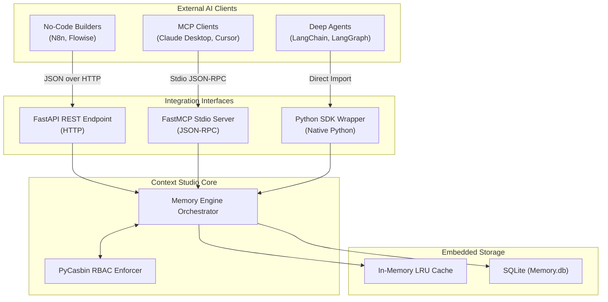
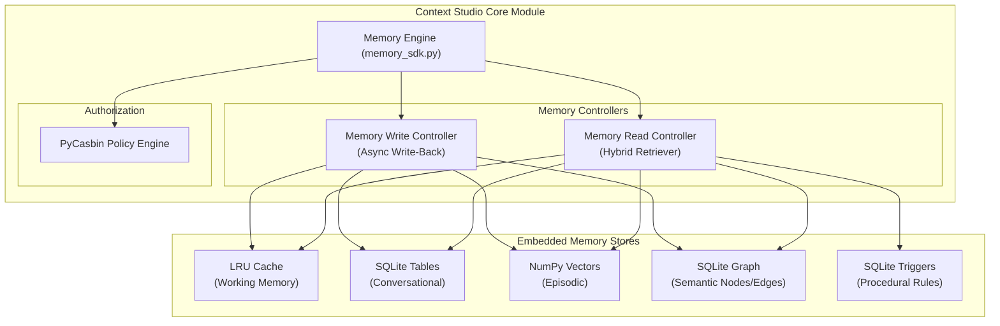

# Implementation Plan — Context Studio (Comprehensive Architecture)

> **Version:** Final (Production-Ready Python SDK)  
> **Date:** 2026-06-21  
> **Status:** ✅ Fully Implemented

---

## Table of Contents

1. [High-Level Design (HLD) — Platform Integrations](#1-high-level-design-hld--platform-integrations)
2. [Low-Level Design (LLD) — Context Studio Internals](#2-low-level-design-lld--context-studio-internals)
3. [Memory Layer Strategies (Deep Dive)](#3-memory-layer-strategies-deep-dive)
4. [Security & RBAC (PyCasbin)](#4-security--rbac-pycasbin)
5. [Memory Pipeline Architecture](#5-memory-pipeline-architecture)
6. [Boundary Cases — Handled](#6-boundary-cases--handled)
7. [Repository Structure (Modular Python)](#7-repository-structure-modular-python)
8. [Database Schemas (SQLAlchemy)](#8-database-schemas-sqlalchemy)

---

## 1. High-Level Design (HLD) — Platform Integrations

> **Design Philosophy:** Context Studio is designed as a **Plug & Play Memory Engine**. The entire platform operates 100% locally without Docker or Cloud SaaS. We use embedded databases (SQLite) and local compute (NumPy) to keep the system lightweight while mimicking production tiering.

Context Studio integrates into the broader AI ecosystem via three distinct pathways:



### 1.1 Integration Points Explained

1. **API Integration (FastAPI):** Exposes standard REST endpoints. Ideal for platforms like n8n or independent frontends. Enforces security via `X-API-Key`.
2. **MCP Integration (Model Context Protocol):** A standard input/output (stdio) server using Anthropic's `mcp` SDK. Allows desktop agents (Claude, Cursor) to inherently read and write to the memory graph via exposed tools (`init_agent`, `save_memory`, `get_context`).
3. **SDK Integration (LangChain):** A native Python class (`ContextStudioMemory`) that subclasses LangChain memory primitives, allowing deep agents to seamlessly use the 5-layer pipeline in memory-intensive chains.

---

## 2. Low-Level Design (LLD) — Context Studio Internals

### 2.1 Service Decomposition (Local-Native)



---

## 3. Memory Layer Strategies (Deep Dive)

Context Studio implements a full 5-tier cognitive architecture directly modeled after advanced AI research papers.

### 3.1 Working Memory (In-Context / Ephemeral)
> **Purpose:** The agent's "RAM" — holds the active session state, reasoning scratchpad, and current context window contents.

| Attribute | Value |
|:---|:---|
| **Store** | Python `cachetools.TTLCache` |
| **Key Pattern** | `wm:{agent_id}:{session_id}` |
| **TTL** | Session duration + 30-minute grace period |
| **Overflow Strategy**| Evicted items are permanently flushed to long-term layers. |

### 3.2 Conversational Memory (Cross-Session Dialogue)
> **Purpose:** Maintains pure dialogue continuity across turns and sessions.

| Attribute | Value |
|:---|:---|
| **Store** | SQLite via SQLAlchemy |
| **Table** | `Memory` (where `memory_type = 'conversational'`) |
| **Retention** | Standard dialogue retrieval for when Working Memory drops off. |

### 3.3 Episodic Memory (Event Log)
> **Purpose:** Persistent records of specific past interactions.

| Attribute | Value |
|:---|:---|
| **Store** | Python In-Memory `numpy` array + SQLite backing |
| **Embedding** | Extracted numerical arrays |
| **Search Algo** | Dot-product similarity (`np.dot`) |
| **Time-Decay** | Scores are multiplied by an exponential decay factor so newer memories surface over older ones, preventing semantic saturation. |

### 3.4 Semantic Memory (Knowledge Base / Facts)
> **Purpose:** Accumulated facts and structured knowledge graphs.

| Attribute | Value |
|:---|:---|
| **Store** | SQLite via SQLAlchemy |
| **Graph Tables** | Relational `agent_id` + `content` metadata |
| **Retrieval** | Extracted dynamically via Regex/Keyword matching across stored facts. |

### 3.5 Procedural Memory (Rules)
> **Purpose:** Hardcoded "If-Then" logic and behavioral guardrails.

| Attribute | Value |
|:---|:---|
| **Store** | SQLite `procedural_rules` table |
| **Retrieval** | Regex matching on inbound queries. If a trigger matches, the engine forcefully injects the "Rule" into the top of the LLM context. |

---

## 4. Security & RBAC (PyCasbin)

To ensure enterprise-grade multi-tenancy on a local machine, Context Studio uses **PyCasbin**.

### 4.1 PyCasbin Model (`casbin_model.conf`)
```ini
[request_definition]
r = sub, obj, act

[policy_definition]
p = sub, obj, act

[role_definition]
g = _, _

[policy_effect]
e = some(where (p.eft == allow))

[matchers]
m = r.sub == "admin" || (r.sub == p.sub && r.obj == p.obj && r.act == p.act)
```

### 4.2 Dynamic Enforcer
- We use `casbin-sqlalchemy-adapter` to store policies directly in the local SQLite database.
- **Auto-Granting:** When a User or Agent writes to a session for the first time, `memory_sdk.py` dynamically injects a Casbin policy into the database: `p, user_A, session_userA, read_write`.
- **Isolation:** If `user_B` attempts to read `session_userA`, the `Enforcer` inherently rejects the operation because no matching policy exists. Admins bypass this constraint.

---

## 5. Memory Pipeline Architecture

When `get_context()` is invoked, the engine performs the following synchronous pipeline:
1. **Security Check:** Validates `SecurityContext` against PyCasbin.
2. **Procedural Layer:** Scans query for trigger words. Appends matched rules to output.
3. **Working Layer:** Pulls recent dialogue from `TTLCache`.
4. **Episodic Layer:** Runs NumPy dot-product vector search across all past memories, applying time-decay.
5. **Conversational Layer:** Queries SQLite for raw dialogue turns.
6. **Synthesis:** Packages all 5 layers into a single JSON object for the LLM.

---

## 6. Boundary Cases — Handled

| Case | Strategy |
|:---|:---|
| **Local Vector Search Scale** | Brute-force dot product in NumPy is O(N). It works well for up to ~10,000 vectors per agent. Future scaling can seamlessly swap NumPy for `faiss-cpu`. |
| **SQLite Concurrency** | We utilize SQLAlchemy connection pooling. SQLite natively supports WAL (Write-Ahead Logging) mode, allowing concurrent reads alongside asynchronous writes without bottlenecking FastAPI or MCP. |
| **Process Crash** | Working Memory (LRU Cache) is lost on crash. Next query recovers gracefully by pulling the raw turn history from the SQLite Conversational Memory layer. |
| **Encoding Crashes** | Standard output (`print`) statements are sanitized to prevent `cp1252` encoding crashes in Windows local environments when rendering emojis. |

---

## 7. Repository Structure (Modular Python)

```text
.
├── casbin_model.conf           # Declarative PyCasbin Authorization Model
├── database.py                 # SQLAlchemy Setup & Connection
├── integrations/               
│   ├── langchain_wrapper.py    # Native SDK wrapper for LangChain/LangGraph
│   └── mcp_server.py           # Anthropic FastMCP Server implementation
├── main.py                     # FastAPI REST server & API endpoints
├── memory_sdk.py               # Core Orchestrator (The 5 Layers & PyCasbin Logic)
├── models.py                   # SQLAlchemy ORM Models (Agents, Memory, etc.)
├── schemas.py                  # Pydantic validation schemas
├── requirements.txt            # Production dependencies (casbin, numpy, fastapi, etc.)
└── test_security.py            # Automated RBAC testing suite
```

---

## 8. Database Schemas (SQLAlchemy)

```python
class Agent(Base):
    __tablename__ = "agents"
    id = Column(String, primary_key=True, index=True)
    tenant_id = Column(String, index=True)
    name = Column(String)
    created_at = Column(DateTime, default=datetime.utcnow)

class Memory(Base):
    __tablename__ = "memories"
    id = Column(Integer, primary_key=True, index=True)
    agent_id = Column(String, ForeignKey("agents.id"))
    session_id = Column(String, index=True)
    memory_type = Column(String)  # 'conversational', 'episodic', 'semantic'
    role = Column(String)
    content = Column(String)
    turn_number = Column(Integer)
    embedding = Column(String)    # JSON string of vector array
    created_at = Column(DateTime, default=datetime.utcnow)

class ProceduralRule(Base):
    __tablename__ = "procedural_rules"
    id = Column(Integer, primary_key=True, index=True)
    agent_id = Column(String, ForeignKey("agents.id"))
    trigger = Column(String)      # Regex or keyword
    instruction = Column(String)  # The rule injected into context
```
*(Note: The `casbin_rule` table is automatically generated and managed by the `casbin-sqlalchemy-adapter`.)*
