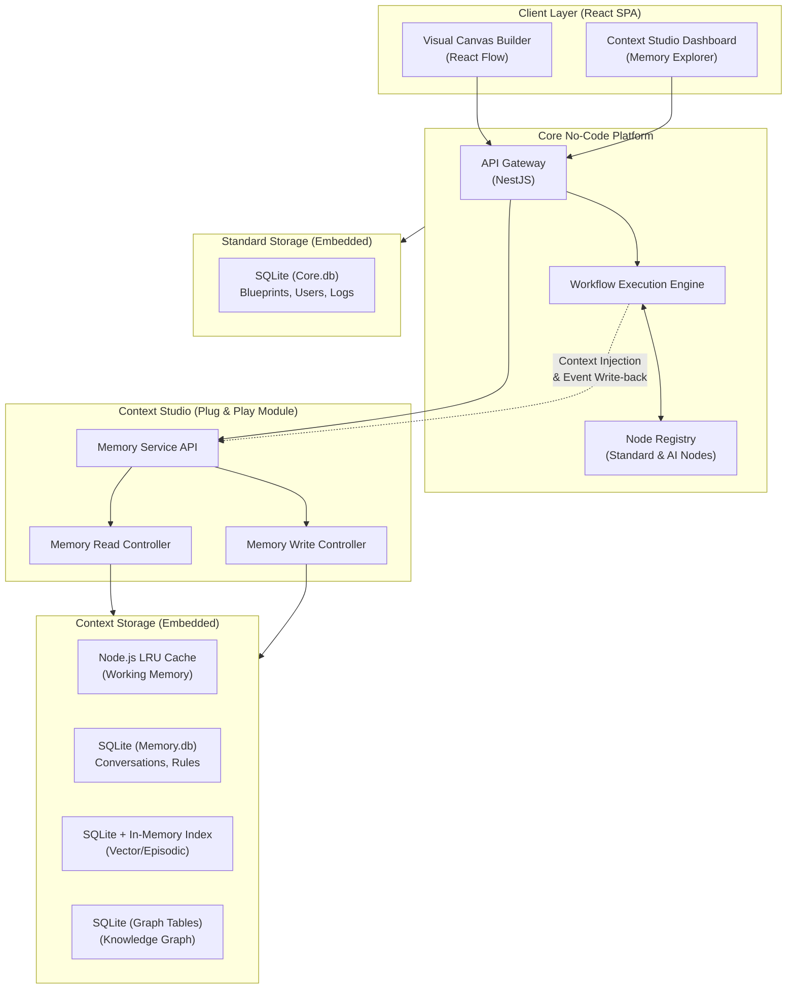
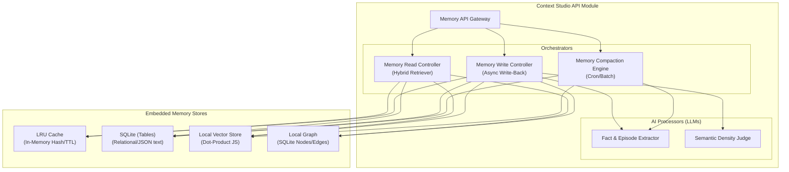

# Implementation Plan — No-Code Agent Builder with Context Studio

> **Version:** 3.0 (Local-Native / No-Docker / No-Cloud)  
> **Date:** 2026-06-21  
> **Status:** 🔶 Awaiting Approval

---

## Table of Contents

1. [High-Level Design (HLD) — Platform Integration](#1-high-level-design-hld--platform-integration)
2. [Low-Level Design (LLD) — Context Studio Internals](#2-low-level-design-lld--context-studio-internals)
3. [Memory Layer Strategies (Deep Dive)](#3-memory-layer-strategies)
4. [Memory Pipeline Architecture](#4-memory-pipeline-architecture)
5. [Boundary Cases — Handled](#5-boundary-cases--handled)
6. [Cases NOT Handled — Explicit Limitations](#6-cases-not-handled--explicit-limitations)
7. [Phase-by-Phase Implementation](#7-phase-by-phase-implementation)
8. [Database Schemas (SQLite)](#8-database-schemas-sqlite)
9. [API Contract Overview](#9-api-contract-overview)
10. [Verification Plan](#10-verification-plan)
11. [Architecture References](#11-architecture-references)

---

## 1. High-Level Design (HLD) — Platform Integration

> **Design Philosophy:** Context Studio is designed as a **Plug & Play** component. The entire platform operates 100% locally without Docker or Cloud SaaS. We use embedded databases (SQLite) and in-memory stores to keep the system lightweight while mimicking production tiering.

### 1.1 Macro Architecture (N8n + Context Studio)



### 1.2 Integration Points

Context Studio integrates with the core platform at three specific points:
1.  **Canvas Integration:** Dedicated "Memory Nodes" (e.g., Save to Memory, Search Memory) are registered in the Node Registry.
2.  **Execution Interceptor:** Before an AI node executes in the Workflow Engine, it queries the Memory Service API to fetch relevant context. After execution, it fires an async event to the Memory Service to store the outcome.
3.  **UI Dashboard:** A separate tab in the frontend that connects directly to the Memory Service API to visualize and curate the stored graphs and vectors.

---

## 2. Low-Level Design (LLD) — Context Studio Internals

### 2.1 Service Decomposition (Local-Native)



---

## 3. Memory Layer Strategies (Deep Dive)

### 3.1 Working Memory (In-Context / Ephemeral)

> **Purpose:** The agent's "RAM" — holds the active session state, reasoning scratchpad, and current context window contents.

| Attribute | Value |
|:---|:---|
| **Store** | Node.js LRU Cache (`lru-cache` npm package) |
| **Key Pattern** | `wm:{tenantId}:{agentId}:{sessionId}` |
| **TTL** | Session duration + 30-minute grace period |
| **Persistence** | Ephemeral — lost if Node.js restarts. |

### 3.2 Conversational Memory (Cross-Session Dialogue)

> **Purpose:** Maintains dialogue continuity across turns and sessions.

| Attribute | Value |
|:---|:---|
| **Store** | SQLite (`Memory.db`) |
| **Table** | `conversation_turns` |
| **Retention** | Configurable: last N turns (default 50) |
| **Overflow Strategy** | Oldest turns are LLM-summarized into a `conversation_summaries` table. |

### 3.3 Episodic Memory (Event Log)

> **Purpose:** Persistent records of specific past interactions.

| Attribute | Value |
|:---|:---|
| **Store** | SQLite metadata + Node.js In-Memory Vector Array |
| **Embedding Model** | OpenAI `text-embedding-3-small` (1536 dims) |
| **Vector Search** | Brute-force dot-product in Node.js (fast enough for <10k memories per agent) |
| **Retention** | Persisted to SQLite, loaded into memory array on startup. |

### 3.4 Semantic Memory (Knowledge Base / Facts)

> **Purpose:** Accumulated facts and structured knowledge.

| Attribute | Value |
|:---|:---|
| **Store** | SQLite (`Memory.db`) |
| **Graph Tables** | `kg_nodes` and `kg_edges` tables in SQLite |
| **Fact Tables** | `semantic_facts` table with BM25-style keyword search (FTS5 in SQLite) |
| **Retrieval** | 1-2 hop recursive SQL queries for Graph retrieval. |

### 3.5 Procedural Memory (Rules)

| Attribute | Value |
|:---|:---|
| **Store** | SQLite (`Memory.db`) |
| **Format** | Structured rule definitions + natural language descriptions |

### 3.6 User Preference Memory & 3.7 Organizational Memory

| Attribute | Value |
|:---|:---|
| **Store** | SQLite (`Memory.db`) |
| **Scope** | Per user/tenant |

---

## 4. Memory Pipeline Architecture

*(The pipeline orchestration logic remains identical to v2. The only difference is the physical storage layer—calling local SQLite/LRU instead of network databases.)*

---

## 5. Boundary Cases — Handled

| Case | Strategy |
|:---|:---|
| **Local Vector Search Scale** | Brute-force dot product in JS is O(N). It works well for up to ~10,000 vectors per agent. If scale exceeds this locally, we implement an HNSW local library (`hnswlib-node`). |
| **SQLite Concurrency** | SQLite locks the file on writes. We enable WAL (Write-Ahead Logging) mode on SQLite to allow concurrent reads alongside writes, preventing bottlenecking the Execution Engine. |
| **Process Crash** | Working Memory (LRU Cache) is lost on crash. Next query recovers gracefully using Conversational Memory (SQLite). |

---

## 6. Cases NOT Handled — Explicit Limitations

| Limitation | Why Not Handled | Future Consideration |
|:---|:---|:---|
| **Horizontal Scaling** | SQLite and LRU Cache run in a single Node.js process. You cannot load-balance this setup across multiple servers. | v2: Migrate to PostgreSQL and Redis when multi-server scaling is required. |
| **Massive Vector Scale** | Brute force in-memory vector search degrades at 100K+ vectors. | v2: Migrate to Qdrant or Pinecone. |

---

## 7. Phase-by-Phase Implementation

### Phase 1 — Foundation (Weeks 1–12)

#### Sprint 1–2: Project Scaffolding & Local Infrastructure

```
Week 1-2 Deliverables:
├── Monorepo setup (Nx or Turborepo)
│   ├── apps/web/              (React + Vite frontend)
│   ├── apps/api/              (NestJS backend)
│   └── packages/context-studio/ (Plug-and-play Memory Module)
├── SQLite Database Setup
│   ├── Core.db (Users, Agents, Executions)
│   └── Memory.db (Conversations, Facts, Vectors, Graph)
├── In-Memory LRU Cache setup
├── Authentication (Local JWT)
└── Development environment (npm run dev)
```

**Notice: No `docker-compose.yml` is required.**

#### Sprint 3–4: Visual Agent Builder (Canvas MVP)
* Deliverables: React Flow canvas integration, Node types, Blueprint serialization.*

#### Sprint 5–6: Basic Execution Engine + Short-term Memory
* Deliverables: Synchronous Execution Engine, Working Memory (LRU), Conversational Memory (SQLite).*

---

### Phase 2 — Memory & Intelligence (Weeks 13–24)

#### Sprint 7–8: Episodic Memory (Local Vector)
* Deliverables: Local dot-product vector search, Episode extraction, Decay algorithm.*

#### Sprint 9–10: Semantic Memory (Local Graph)
* Deliverables: SQLite Graph tables, Fact extraction, Hybrid Retrieval.*

---

## 8. Database Schemas (SQLite)

We use SQLite for local storage. Since SQLite doesn't natively support `UUID` or `JSONB`, we use `TEXT` for both. We use Prisma ORM to automatically handle the JSON parsing and UUID generation.

```sql
-- ENABLE WAL MODE FOR CONCURRENCY
PRAGMA journal_mode=WAL;

-- ============================================================
-- CORE TABLES (Core.db)
-- ============================================================

CREATE TABLE tenants (
    id              TEXT PRIMARY KEY,
    name            TEXT NOT NULL,
    slug            TEXT UNIQUE NOT NULL,
    plan            TEXT DEFAULT 'free',
    quotas          TEXT DEFAULT '{}',
    settings        TEXT DEFAULT '{}',
    created_at      DATETIME DEFAULT CURRENT_TIMESTAMP
);

CREATE TABLE agents (
    id              TEXT PRIMARY KEY,
    tenant_id       TEXT NOT NULL,
    name            TEXT NOT NULL,
    blueprint       TEXT NOT NULL, -- JSON String
    memory_config   TEXT NOT NULL, -- JSON String
    created_at      DATETIME DEFAULT CURRENT_TIMESTAMP,
    FOREIGN KEY(tenant_id) REFERENCES tenants(id)
);

-- ============================================================
-- MEMORY TABLES (Memory.db)
-- ============================================================

CREATE TABLE conversation_turns (
    id              TEXT PRIMARY KEY,
    agent_id        TEXT NOT NULL,
    session_id      TEXT NOT NULL,
    turn_number     INTEGER NOT NULL,
    role            TEXT NOT NULL,
    content         TEXT NOT NULL,
    created_at      DATETIME DEFAULT CURRENT_TIMESTAMP
);

-- ============================================================
-- GRAPH & VECTOR TABLES (Memory.db)
-- ============================================================

CREATE TABLE kg_nodes (
    id              TEXT PRIMARY KEY,
    agent_id        TEXT NOT NULL,
    name            TEXT NOT NULL,
    type            TEXT NOT NULL,
    properties      TEXT DEFAULT '{}' -- JSON String
);

CREATE TABLE kg_edges (
    id              TEXT PRIMARY KEY,
    source_id       TEXT NOT NULL,
    target_id       TEXT NOT NULL,
    relation_type   TEXT NOT NULL,
    confidence      REAL DEFAULT 1.0,
    FOREIGN KEY(source_id) REFERENCES kg_nodes(id),
    FOREIGN KEY(target_id) REFERENCES kg_nodes(id)
);

CREATE TABLE episodic_vectors (
    id              TEXT PRIMARY KEY,
    agent_id        TEXT NOT NULL,
    summary         TEXT NOT NULL,
    vector_data     TEXT NOT NULL, -- JSON Array of floats
    importance      INTEGER DEFAULT 5,
    decay_score     REAL DEFAULT 1.0,
    created_at      DATETIME DEFAULT CURRENT_TIMESTAMP
);
```

---

## 9. API Contract Overview
*(Remains identical. The frontend and core platform do not know the backend is using SQLite instead of PostgreSQL.)*

---

## 10. Verification Plan

- `npm run test:memory:vector` — Validates that the local JS dot-product search matches expected similarity thresholds.
- `npm run test:memory:graph` — Validates that recursive SQLite queries correctly mimic 2-hop Neo4j graph traversals.
- `npm run test:load` — Evaluates SQLite WAL mode under concurrent AI agent thread executions to ensure no database locking.

---

## 11. Architecture References
*(Same adaptations from MemGPT, SimpleMem, and Mem0, applied to embedded infrastructure).*
