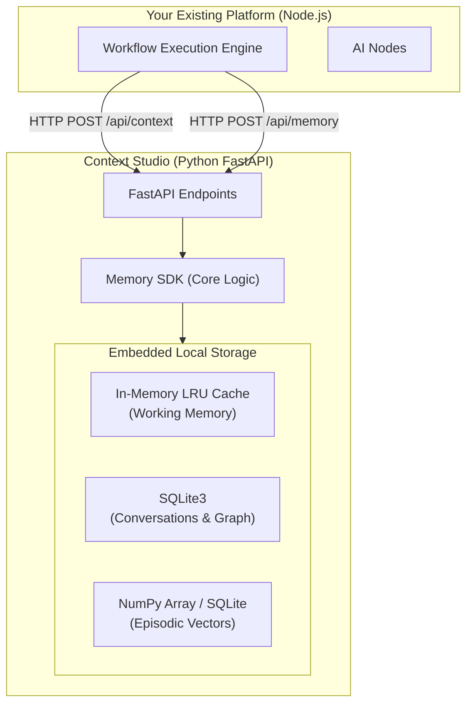

# Implementation Plan — Context Studio (Python Microservice)

> **Version:** 4.0 (Python / FastAPI / Local-Native)  
> **Date:** 2026-06-21  
> **Status:** 🔶 Awaiting Approval

## Goal Description
The user already has the core workflow platform (canvas, execution engine) built. The goal is to build **only the Memory Context Layer (Context Studio)**. 
To achieve this, we will implement the Context Studio entirely in **Python** as a standalone, plug-and-play microservice. The existing platform will integrate with this Python service via lightweight REST APIs.

We will maintain the strict **"No-Docker, No-Cloud"** constraint by leveraging embedded Python libraries (SQLite, CacheTools, NumPy).

---

## User Review Required

> [!IMPORTANT]
> **API Integration Strategy:** Because your existing platform is likely written in Node.js/TypeScript (like n8n), the cleanest way to "plug in" this Python memory layer is by exposing it as a local REST API using **FastAPI**. Your existing platform will simply make `HTTP POST /memory/retrieve` and `HTTP POST /memory/save` requests to this Python server running on localhost. Does this API approach work for your existing platform?

---

## 1. High-Level Design (HLD)



---

## 2. Component Breakdown

### 2.1 Core Frameworks
- **Language:** Python 3.10+
- **API Framework:** `FastAPI` (for lightning-fast, typed REST endpoints)
- **Database ORM:** `SQLAlchemy` (with SQLite dialect)
- **Vector Math:** `NumPy` (for local cosine similarity / dot-product)
- **Working Memory:** `cachetools` (for local LRU caching)

### 2.2 Local Storage Mapping
| Memory Tier | Python/Local Implementation |
| :--- | :--- |
| **Working Memory** | `cachetools.TTLCache` (in-memory RAM) |
| **Conversational Memory** | SQLite table (`conversation_turns`) |
| **Episodic Memory** | SQLite for metadata + `numpy` arrays for local dot-product search |
| **Semantic Graph** | SQLite tables (`kg_nodes`, `kg_edges`) with recursive queries |

---

## 3. Proposed Changes & File Structure

```text
context_studio_python/
├── main.py                 # FastAPI application and route definitions
├── memory_sdk.py           # Core ContextStudio Python class (logic)
├── database.py             # SQLAlchemy configuration and SQLite setup
├── models.py               # SQLAlchemy SQLite table definitions
├── schemas.py              # Pydantic models for API validation
├── requirements.txt        # Python dependencies
└── test_integration.py     # Python test script
```

### 3.1 API Endpoints to Expose
Your existing platform will interact with these endpoints:
- `POST /api/init` - Initialize/Create an Agent's memory space.
- `POST /api/context` - Retrieve assembled context (Working, Episodic, Semantic) for a specific agent query.
- `POST /api/memory` - Write back a new conversation turn or extracted fact to the memory store.

---

## 4. Verification Plan

1. **Scaffold the Python API:** Create the virtual environment, install FastAPI, SQLAlchemy, and NumPy.
2. **Implement Logic:** Translate our Javascript SQLite logic, dot-product math, and graph traversals into Python.
3. **Test Locally:** 
   - I will provide a Python test script (`test_integration.py`) that simulates your platform calling the APIs.
   - I will also provide `cURL` commands so you can test hitting the API directly from your terminal to see how your existing platform will interact with it.
