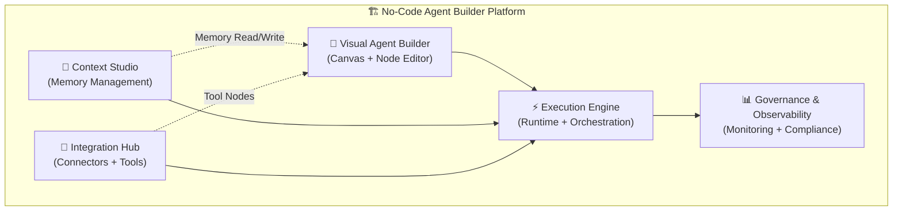
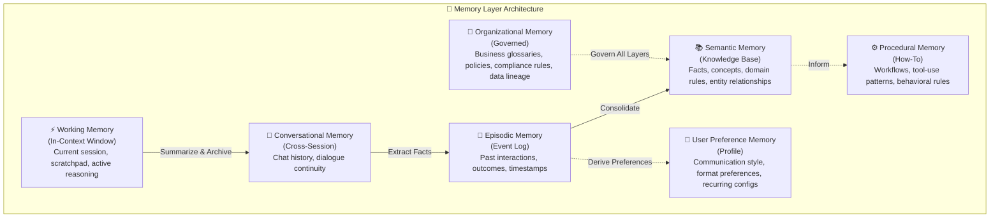
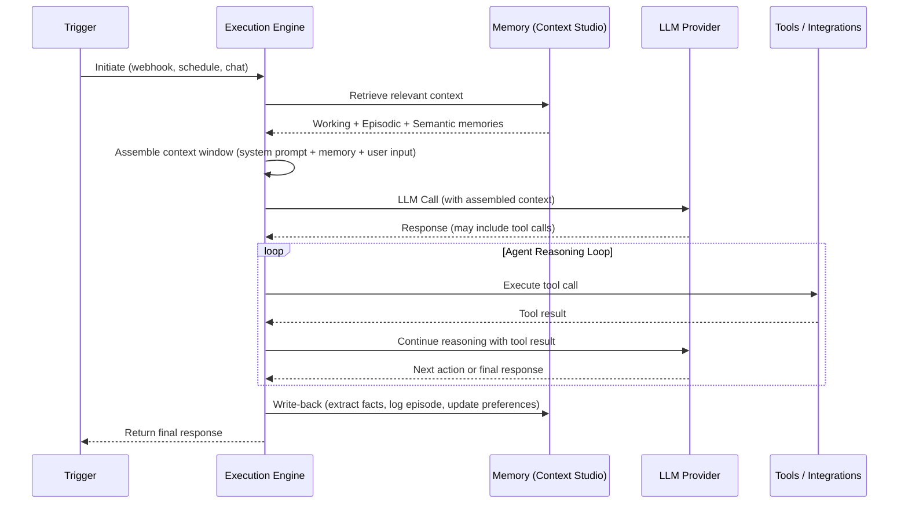
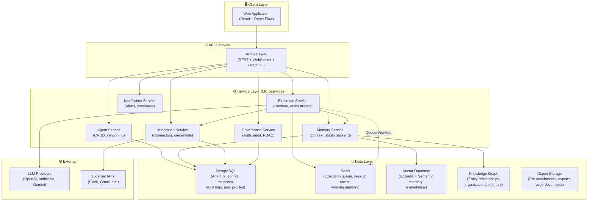

# No-Code Agent Builder with Context Studio — Requirements Document

> **Version:** 1.0 — Draft for Review  
> **Date:** 2026-06-21  
> **Status:** 🔶 Awaiting Approval

---

## 1. Product Vision

Build a **production-grade, no-code AI agent builder** — a visual platform (inspired by n8n, Dify, and CrewAI) where users can design, deploy, and manage autonomous AI agents without writing code. Its core differentiator is the **Context Studio** — a dedicated module for managing, visualizing, and curating agent long-term memory at scale.

### 1.1 Problem Statement

| Problem | Impact |
|:---|:---|
| Building AI agents requires deep engineering expertise | Limits adoption to developers only |
| LLMs are stateless — every call starts from scratch | Agents cannot learn, personalize, or maintain continuity |
| ~65% of enterprise agent failures trace to degraded context, not model limits | Poor memory management kills production reliability |
| No unified tool exists to **see, curate, and govern** what an agent remembers | Memory is a black box — debugging is guesswork |

### 1.2 Product Thesis

> A no-code agent builder that treats **memory as a first-class, observable, governable layer** — not an afterthought — will unlock production-grade AI agents for non-technical teams while giving engineering teams the visibility and control they need.

### 1.3 Key Differentiators

1. **Context Studio** — Visual memory management, gap analysis, and governance (no competitor offers this as a core module)
2. **Memory-Augmented Agent Canvas** — Every agent has a configurable memory architecture built in, not bolted on
3. **Hybrid No-Code + Code** — Visual builder for 90% of workflows; inline code nodes for the remaining 10%
4. **Production-First** — Multi-tenant memory isolation, credential security, queue-based execution, and observability from day one

---

## 2. Target Users

| Persona | Description | Primary Needs |
|:---|:---|:---|
| **Citizen Builder** | Business analyst, ops manager, product manager | Drag-and-drop agent creation; no code required; pre-built templates |
| **Technical Builder** | Developer, data scientist, ML engineer | Custom code nodes; API access; version control; extensibility |
| **Context Engineer** | New role — manages agent memory & knowledge | Memory visualization; gap analysis; relevance tuning; compliance tools |
| **Platform Admin** | DevOps, IT admin, security team | Multi-tenant management; RBAC; audit logs; scaling; credential governance |

---

## 3. Core Modules Overview

The platform consists of **five core modules**:

| Module | Purpose |
|:---|:---|
| **Visual Agent Builder** | Drag-and-drop canvas for designing agent workflows |
| **Context Studio** | Manage, visualize, curate, and govern agent long-term memory |
| **Execution Engine** | Runtime that orchestrates agent execution, memory retrieval, and tool calls |
| **Integration Hub** | Pre-built connectors, custom API nodes, credential management |
| **Governance & Observability** | Monitoring, audit logging, RBAC, compliance, and analytics |

---

## 4. Detailed Functional Requirements

### 4.1 Visual Agent Builder (Canvas)

#### FR-AB-01: Drag-and-Drop Node Canvas
- Grid-based, zoomable, pannable canvas with mini-map navigation
- Snap-to-grid alignment for clean layouts
- Directional edges (arrows) showing data flow between nodes
- Multi-select, copy/paste, undo/redo operations
- Canvas outputs a serialized JSON blueprint of the workflow

#### FR-AB-02: Node Type System

| Category | Node Types | Description |
|:---|:---|:---|
| **Triggers** | Webhook, Schedule (Cron), App Event, Chat Trigger, Manual | Entry points that initiate agent execution |
| **AI Core** | LLM Call, AI Agent, Prompt Template, Output Parser | Central reasoning and generation nodes |
| **Memory** | Read Memory, Write Memory, Memory Search, Memory Compact | Interact with Context Studio memory layers |
| **Logic** | IF/ELSE, Switch, Loop, Merge, Split, Filter, Wait | Control flow and data routing |
| **Actions** | HTTP Request, Database Query, Send Email, API Call | Execute operations on external systems |
| **Code** | JavaScript Node, Python Node, Expression Node | Custom code execution for advanced logic |
| **Tools** | Calculator, Web Search, File Parser, Custom Tool | Capabilities agents can invoke autonomously |
| **Human-in-the-Loop** | Approval Gate, Manual Review, Feedback Collector | Pause execution for human decision |

#### FR-AB-03: Node Configuration Panel
- Contextual sidebar panel opens when a node is selected
- Progressive disclosure: basic settings visible first; advanced settings (retry logic, timeout, prompt tuning) in collapsible sections
- Real-time field validation with visual error indicators
- Input/output schema preview for each node
- Test execution for individual nodes with mock data

#### FR-AB-04: Agent Templates & Marketplace
- Pre-built agent templates (Customer Support Bot, Data Analyst, Content Generator, etc.)
- Community marketplace for sharing and importing agent blueprints
- Template categories, search, and ratings
- One-click clone and customize

#### FR-AB-05: Multi-Agent Orchestration
- Manager-agent → sub-agent delegation pattern
- Parallel agent execution with merge/join
- Agent-to-agent communication channels
- Nested workflows (entire workflows as tool nodes)

#### FR-AB-06: Version Control
- Git-style versioning of agent blueprints
- Diff view between versions
- Rollback to any previous version
- Branch/merge for collaborative editing

---

### 4.2 Context Studio (Long-Term Memory Management)

> [!IMPORTANT]
> This is the platform's **core differentiator** — the module that makes this more than another n8n clone.

#### FR-CS-01: Memory Layer Architecture

The system supports a **multi-layered memory architecture** inspired by the CoALA framework and Letta's OS-like memory model:

| Layer | Persistence | Storage | Write Trigger |
|:---|:---|:---|:---|
| Working | Ephemeral (session) | Context window | Automatic (every turn) |
| Conversational | Session / cross-session | Redis + PostgreSQL | Automatic (end of turn) |
| Episodic | Persistent | Vector DB + Event Log | Automatic (post-interaction) |
| Semantic | Persistent | Vector DB + Knowledge Graph | LLM extraction + manual curation |
| Procedural | Persistent | Config store + Prompt templates | Manual + learned patterns |
| User Preference | Persistent | User profile DB | Derived from episodic + manual |
| Organizational | Persistent, governed | Governed knowledge base | Admin-curated, version-controlled |

#### FR-CS-02: Memory Visualization Dashboard

- **Memory Explorer:** Browse all memory layers with filtering by type, date range, relevance score, tenant, and agent
- **Entity Graph View:** Interactive knowledge graph visualization showing entities and their relationships
- **Timeline View:** Chronological view of episodic memories with event details
- **Memory Heatmap:** Visual indicator of memory density and usage patterns across topics/entities
- **Context Window Preview:** See exactly what will be injected into the LLM's context for a given query

#### FR-CS-03: Memory Curation Tools

- **Add / Edit / Delete** individual memories across all layers
- **Merge** duplicate or overlapping memories into consolidated entries
- **Split** complex memories into atomic facts
- **Bulk Operations:** Select multiple memories for bulk edit, tag, archive, or delete
- **Import / Export:** Upload knowledge bases (CSV, JSON, Markdown, PDF); export memories for backup or migration

#### FR-CS-04: Memory Quality & Gap Analysis

- **Contradiction Detector:** AI-powered scan for conflicting memories (e.g., "User prefers Python" vs. "User prefers JavaScript")
- **Staleness Indicator:** Flag memories that haven't been accessed or updated beyond a configurable threshold
- **Coverage Gap Analysis:** Given an agent's expected domain, identify topics where memory is sparse or missing
- **Confidence Scoring:** Each memory has a confidence score based on source, recency, and corroboration
- **Agent Confusion Surface:** Automatically surface instances where agents produced low-confidence or incorrect responses due to missing/conflicting context (inspired by Hex Context Studio)

#### FR-CS-05: Memory Retrieval Configuration

- **Hybrid Search:** Combine semantic (vector) search + keyword (BM25) search + metadata filters
- **Relevance Scoring Controls:** Configure weights for recency, importance, access frequency, and semantic similarity
- **Memory Decay Settings:** Configurable exponential decay curves per memory layer
- **Retrieval Policies:** Define per-agent rules for how much memory to retrieve, from which layers, with what priority
- **Context Budget Allocation:** Set maximum token budgets per memory layer for context window packing

#### FR-CS-06: Memory Lifecycle Management

- **Automatic Compaction:** LLM-based summarization of verbose episodic memories into concise semantic facts
- **Memory Consolidation Pipeline:** Scheduled jobs that consolidate, deduplicate, and prune memories
- **TTL (Time-to-Live) Policies:** Configure retention periods per memory type and tenant
- **Memory Versioning:** Git-style version history for memory entries; diff view; rollback capability
- **Write-Back Pipeline:** After each agent interaction, automatically extract new facts, update preferences, and log episodic records

#### FR-CS-07: Memory Testing & Validation

- **Context Sandbox:** Test how memory changes affect agent responses before deploying to production
- **A/B Memory Testing:** Run parallel agent instances with different memory configurations and compare outputs
- **Regression Testing:** Define expected agent behaviors; validate that memory changes don't break existing capabilities
- **Review & Publish Workflow:** Staging → Review → Approve → Publish pipeline for memory updates (HITL)

#### FR-CS-08: Compliance & Privacy

- **PII Detection & Redaction:** Automatic scanning of memories for personally identifiable information
- **Right to Be Forgotten:** One-click deletion of all memories associated with a specific user/entity across all layers
- **Data Residency Controls:** Configure which geographic regions memory data can be stored in
- **Audit Trail:** Every memory read, write, update, and delete is logged with actor, timestamp, and reason
- **Encryption:** At-rest and in-transit encryption for all memory data

---

### 4.3 Execution Engine

#### FR-EE-01: Runtime Modes

| Mode | Use Case | Technology |
|:---|:---|:---|
| **Synchronous** | Simple, fast workflows (<30s) | Direct execution |
| **Queue-Based** | Complex, long-running agents | Redis + worker processes |
| **Streaming** | Chat interfaces, real-time responses | WebSocket / SSE |

#### FR-EE-02: Agent Execution Flow

#### FR-EE-03: Error Handling & Resilience
- Configurable retry policies per node (exponential backoff, max retries)
- Circuit breaker pattern for failing external services
- Dead letter queue for failed executions
- Graceful degradation: if memory retrieval fails, continue with available context
- Execution timeout enforcement per node and per workflow

#### FR-EE-04: Sandboxed Code Execution
- JavaScript and Python code nodes run in isolated sandboxes (Docker containers / V8 isolates)
- Resource limits: CPU, memory, execution time
- No network access by default (opt-in per node)
- Dependency management for custom packages

---

### 4.4 Integration Hub

#### FR-IH-01: Pre-Built Connectors
- **Target: 50+ connectors at launch**, expanding to 200+ within 12 months
- Priority connectors: OpenAI, Anthropic, Google Gemini, Slack, Gmail, Google Sheets, Notion, Airtable, PostgreSQL, MySQL, MongoDB, Stripe, GitHub, Jira, HubSpot, Salesforce, Twilio
- Each connector has typed input/output schemas and built-in authentication

#### FR-IH-02: Generic API Node
- HTTP Request node supporting GET, POST, PUT, PATCH, DELETE
- Dynamic headers, query parameters, and body templates
- Response parsing (JSON, XML, HTML, CSV)
- Pagination handling (cursor, offset, link-header)
- Rate limiting and throttling configuration

#### FR-IH-03: Credential Management
- Centralized, encrypted credential vault
- OAuth2 flow support with automatic token refresh
- API Key, Basic Auth, Bearer Token, JWT support
- Credentials decoupled from workflow definitions
- Role-based credential access (who can use which credentials)
- Dynamic runtime credentials for multi-tenant scenarios

#### FR-IH-04: Vector Store Connectors
- Native connectors for: Pinecone, Weaviate, Qdrant, Chroma, PostgreSQL (pgvector)
- Unified interface: embed → store → search → retrieve
- Configurable embedding models (OpenAI, Cohere, open-source)

#### FR-IH-05: Custom Node SDK
- TypeScript SDK for building custom connector nodes
- Node definition schema: inputs, outputs, credentials, execute function
- Hot-reload during development
- Publish to marketplace

---

### 4.5 Governance & Observability

#### FR-GO-01: Execution Monitoring
- Real-time dashboard: active executions, queue depth, success/failure rates, latency percentiles
- Per-node execution logs with full input/output trace
- On-canvas live status indicators (green = success, yellow = running, red = error, gray = skipped)
- Execution history with search, filter, and replay capabilities

#### FR-GO-02: Agent Analytics
- Token usage and cost tracking per agent, per tenant, per time period
- Memory utilization metrics (reads, writes, compaction events, storage size)
- Agent performance metrics: task completion rate, user satisfaction, response latency
- Conversation analytics: common queries, failure patterns, escalation triggers

#### FR-GO-03: Role-Based Access Control (RBAC)
- Predefined roles: Viewer, Builder, Context Engineer, Admin, Super Admin
- Custom role definitions with granular permissions
- Per-agent, per-workspace, per-memory-layer permission scoping
- SSO integration (SAML 2.0, OIDC)

#### FR-GO-04: Audit Logging
- Immutable audit log for all platform actions
- Categories: agent modifications, memory changes, credential access, execution events, admin actions
- Export to external SIEM systems
- Configurable retention policies

#### FR-GO-05: Multi-Tenancy
- Workspace-level isolation (each tenant = workspace)
- Per-workspace: agents, memories, credentials, execution history, analytics
- Namespace-isolated memory with configurable encryption boundaries
- Resource quotas per workspace (executions/day, memory storage, token budget)

---

## 5. Non-Functional Requirements

### 5.1 Performance

| Metric | Target |
|:---|:---|
| Canvas load time | < 2 seconds |
| Node configuration panel open | < 200ms |
| Agent execution start (trigger → first node) | < 500ms |
| Memory retrieval latency (95th percentile) | < 300ms |
| Context Studio dashboard load | < 3 seconds |
| Concurrent active executions (per instance) | 100+ |

### 5.2 Scalability

| Dimension | Approach |
|:---|:---|
| Horizontal scaling | Queue-based execution with Redis; add workers to scale |
| Memory storage | Vector DB auto-scaling (managed) + PostgreSQL read replicas |
| Multi-region | Deployable across regions for data residency compliance |
| Tenant scaling | Namespace isolation; per-tenant resource quotas |

### 5.3 Reliability

| Metric | Target |
|:---|:---|
| Platform uptime | 99.9% |
| Data durability | 99.999% (replicated storage) |
| Execution delivery guarantee | At-least-once (with idempotency keys) |
| Recovery Time Objective (RTO) | < 15 minutes |
| Recovery Point Objective (RPO) | < 1 minute |

### 5.4 Security

- All data encrypted at rest (AES-256) and in transit (TLS 1.3)
- Credential vault with envelope encryption (master key + per-credential DEKs)
- Memory isolation: one tenant's data never accessible to another tenant
- Input sanitization for prompt injection defense
- Regular security audits and penetration testing
- SOC 2 Type II compliance target (12 months post-launch)

### 5.5 Usability

- Onboarding tutorial for first-time users (< 10 minutes to first running agent)
- In-app documentation and contextual help
- Keyboard shortcuts for power users
- Mobile-responsive monitoring dashboard (read-only)
- Accessibility: WCAG 2.1 AA compliance

---

## 6. High-Level Architecture

---

## 7. Technology Recommendations

| Component | Recommended Technology | Rationale |
|:---|:---|:---|
| **Frontend Framework** | React 19 + TypeScript | Ecosystem maturity; React Flow for canvas |
| **Canvas Library** | React Flow | Industry standard for node-based editors; used by Langflow, Flowise |
| **Backend Runtime** | Node.js + TypeScript | Same language as frontend; proven by n8n at scale |
| **API Layer** | NestJS (REST + WebSocket + GraphQL) | Enterprise-grade Node.js framework; modular architecture |
| **Primary Database** | PostgreSQL 16 | Relational data; proven reliability; pgvector for simple vector needs |
| **Queue / Cache** | Redis 7 | Execution queue, session cache, pub/sub for real-time updates |
| **Vector Database** | Qdrant (self-hosted) or Pinecone (managed) | Qdrant: performance + cost-efficiency; Pinecone: zero-ops |
| **Knowledge Graph** | Neo4j | Industry leader for graph databases; Cypher query language |
| **Object Storage** | MinIO (self-hosted) or S3 (cloud) | S3-compatible; works in both environments |
| **Code Sandbox** | Docker containers + gVisor | Secure isolation for custom code execution |
| **Authentication** | Keycloak | Open-source IAM; SSO, OIDC, SAML support |
| **Deployment** | Docker Compose (dev) → Kubernetes (prod) | Industry standard; horizontal scaling |
| **Monitoring** | Prometheus + Grafana | Open-source; comprehensive metrics and dashboards |
| **Logging** | ELK Stack (Elasticsearch, Logstash, Kibana) | Centralized log management and search |

---

## 8. Phased Delivery Roadmap

### Phase 1 — Foundation (Months 1–3)
> **Goal:** Core platform with basic agent building and Context Studio MVP

- [ ] Visual Agent Builder canvas (drag-and-drop, node system, JSON blueprint serialization)
- [ ] Core node types: Trigger (Webhook, Manual, Schedule), LLM Call, IF/ELSE, HTTP Request, Code (JS)
- [ ] Basic execution engine (synchronous mode)
- [ ] **Context Studio MVP:** Working Memory + Conversational Memory + Memory Explorer UI
- [ ] PostgreSQL + Redis setup
- [ ] Basic credential management (API Key, Bearer Token)
- [ ] User authentication (email/password + OAuth)
- [ ] 10 pre-built connectors (OpenAI, Anthropic, Slack, Gmail, Notion, Airtable, PostgreSQL, GitHub, HTTP Request, Webhook)

### Phase 2 — Memory & Intelligence (Months 4–6)
> **Goal:** Full Context Studio + production execution

- [ ] **Context Studio Full:** Episodic + Semantic + User Preference memory layers
- [ ] Vector Database integration (Qdrant / Pinecone)
- [ ] Memory visualization (Entity Graph, Timeline, Heatmap)
- [ ] Memory curation tools (add/edit/delete/merge/split)
- [ ] Memory retrieval configuration (hybrid search, relevance scoring, decay)
- [ ] Queue-based execution engine (Redis workers)
- [ ] AI Agent node with autonomous tool use
- [ ] Multi-agent orchestration (manager → sub-agent pattern)
- [ ] Streaming execution (WebSocket/SSE for chat interfaces)
- [ ] 30 additional connectors

### Phase 3 — Governance & Scale (Months 7–9)
> **Goal:** Enterprise-ready with governance, compliance, and advanced memory features

- [ ] **Context Studio Advanced:** Contradiction detector, gap analysis, confidence scoring, agent confusion surface
- [ ] Knowledge Graph integration (Neo4j) for organizational memory
- [ ] Procedural memory layer
- [ ] Memory testing & validation (context sandbox, A/B testing, regression)
- [ ] Review & publish workflow for memory changes
- [ ] RBAC with custom roles
- [ ] Full audit logging
- [ ] Multi-tenancy with workspace isolation
- [ ] PII detection & right-to-be-forgotten
- [ ] Execution monitoring dashboard
- [ ] Agent analytics and cost tracking
- [ ] SSO integration (SAML, OIDC)

### Phase 4 — Ecosystem & Polish (Months 10–12)
> **Goal:** Community ecosystem, marketplace, and advanced features

- [ ] Agent template marketplace (community contributions)
- [ ] Custom Node SDK + documentation
- [ ] Memory compaction and consolidation pipelines
- [ ] Memory versioning (git-style for memory entries)
- [ ] Data residency controls (multi-region)
- [ ] Mobile-responsive monitoring dashboard
- [ ] Onboarding tutorials and in-app documentation
- [ ] Performance optimization (< 2s canvas load, < 300ms memory retrieval)
- [ ] Security audit and SOC 2 preparation
- [ ] 100+ additional connectors

---

## 9. Open Questions for Discussion

> [!IMPORTANT]
> The following questions will significantly impact architecture and scope. Please provide direction.

1. **Deployment Model:** Will this be **self-hosted only**, **cloud-hosted (SaaS)**, or **both**? This affects multi-tenancy architecture, credential management, and infrastructure choices.

2. **LLM Strategy:** Should the platform be **LLM-agnostic** (support any provider) or optimize for a **specific provider** (e.g., OpenAI-first with others as secondary)?

3. **Open Source vs. Proprietary:** Should this follow n8n's **fair-code / source-available** model, be **fully open source** (MIT/Apache), or **proprietary**? This impacts community adoption and business model.

4. **Context Studio Priority:** The Context Studio has many features. Should we treat it as the **primary product** (build a standalone Context Studio that can plug into any agent framework) or as an **integrated module** within the agent builder?

5. **Memory Infrastructure:** For the vector database, should we **self-host Qdrant** (more control, lower cost at scale) or use **managed Pinecone** (zero ops, faster to market)?

6. **Code Execution Scope:** For the Code nodes, should we support **JavaScript only** (simpler, same runtime as backend) or **JavaScript + Python** (broader appeal, more complex sandboxing)?

7. **Target Scale:** What is the expected scale at launch? This affects whether we need Kubernetes from day one or can start with Docker Compose.
   - < 100 agents, < 10 tenants → Docker Compose is fine
   - 100–1,000 agents, 10–100 tenants → Kubernetes recommended
   - 1,000+ agents, 100+ tenants → Kubernetes required

8. **Naming:** Does the platform have a name, or should we propose one?

---

## 10. Glossary

| Term | Definition |
|:---|:---|
| **Agent** | An AI-powered autonomous workflow that can reason, use tools, and maintain memory |
| **Node** | A single unit of logic on the canvas (trigger, action, condition, etc.) |
| **Blueprint** | The serialized JSON representation of an agent's workflow |
| **Context Window** | The maximum amount of text an LLM can process in a single call |
| **Context Studio** | The platform module for managing agent long-term memory |
| **Episodic Memory** | Stored records of specific past interactions and outcomes |
| **Semantic Memory** | Accumulated facts, concepts, and domain knowledge |
| **Procedural Memory** | How-to knowledge — workflows, tool-use patterns, behavioral rules |
| **RAG** | Retrieval-Augmented Generation — injecting retrieved knowledge into LLM prompts |
| **Vector Database** | Database optimized for storing and searching high-dimensional embeddings |
| **Knowledge Graph** | Graph database storing entities and their relationships |
| **Memory Decay** | Mechanism that reduces the accessibility of old/unused memories over time |
| **Memory Compaction** | LLM-based summarization of verbose memories into concise facts |
| **HITL** | Human-in-the-Loop — requiring human approval at critical decision points |
| **Multi-Tenancy** | Architecture where a single platform instance serves multiple isolated customers |
